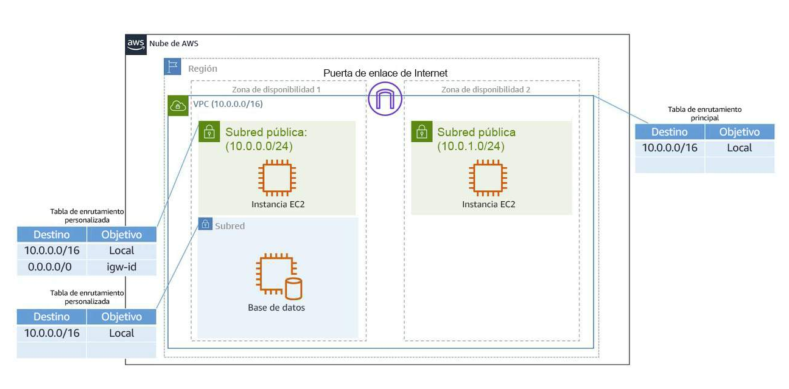
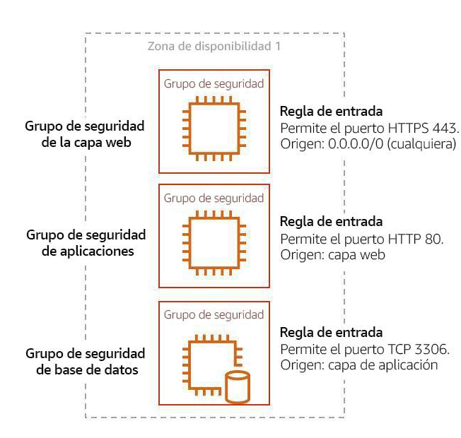

GUÍA CERTIFICACIÓN AWS + SORTEO 
https://www.youtube.com/watch?v=f5uGX-pJuVw


- [AWS Technical Essentials](#aws-technical-essentials)
  - [Inrtoducción](#inrtoducción)
    - [AWS Global Infrastructure](#aws-global-infrastructure)
    - [Interactuando con AWS](#interactuando-con-aws)
    - [Seguridad y modelo de responsabilidad compartida de AWS](#seguridad-y-modelo-de-responsabilidad-compartida-de-aws)
    - [Protección del usuario root de AWS](#protección-del-usuario-root-de-aws)
      - [Prácticas recomendadas al trabajar con el usuario raíz de AWS](#prácticas-recomendadas-al-trabajar-con-el-usuario-raíz-de-aws)
      - [Autenticación multifactor (MFA)](#autenticación-multifactor-mfa)
    - [AWS IAM (Identity and Access Management)](#aws-iam-identity-and-access-management)
      - [IAM](#iam)
      - [Características de IAM](#características-de-iam)
      - [Usuario de IAM](#usuario-de-iam)
      - [Credenciales de usuario de IAM](#credenciales-de-usuario-de-iam)
      - [Grupos de IAM](#grupos-de-iam)
      - [Políticas de IAM](#políticas-de-iam)
    - [Roles](#roles)
  - [Informática como servicio](#informática-como-servicio)
    - [Servidores](#servidores)
    - [Amazon EC2](#amazon-ec2)
      - [Amazon Machine Image](#amazon-machine-image)
    - [Amazon EC2](#amazon-ec2-1)
      - [Tipos de instancias de Amazon EC2](#tipos-de-instancias-de-amazon-ec2)
      - [Familias de instancias](#familias-de-instancias)
      - [Ubicaciones de instancias EC2](#ubicaciones-de-instancias-ec2)
      - [Diseño para la alta disponibilidad](#diseño-para-la-alta-disponibilidad)
      - [Ciclo de vida de la instancia EC2](#ciclo-de-vida-de-la-instancia-ec2)
      - [Precio](#precio)
    - [Contenedores](#contenedores)
      - [Amazon ECS](#amazon-ecs)
      - [Amazon EKS](#amazon-eks)
    - [Adopción del modelo sin servidor](#adopción-del-modelo-sin-servidor)
      - [AWS Fargate](#aws-fargate)
      - [AWS Lambda](#aws-lambda)
      - [Funcionamiento de AWS Lambda](#funcionamiento-de-aws-lambda)
      - [Controlador de funciones de AWS Lambda](#controlador-de-funciones-de-aws-lambda)
      - [Nomenclatura](#nomenclatura)
      - [Pormenorización de la facturación](#pormenorización-de-la-facturación)
      - [Código fuente](#código-fuente)
  - [Redes](#redes)
    - [Aspectos bases de Redes](#aspectos-bases-de-redes)
      - [Definición de las redes](#definición-de-las-redes)
      - [Conceptos básicos de las redes](#conceptos-básicos-de-las-redes)
        - [Direcciones IP](#direcciones-ip)
      - [Notación CIDR](#notación-cidr)
    - [Amazon VPC](#amazon-vpc)
      - [Subred](#subred)
      - [Alta disponibilidad con una VPC](#alta-disponibilidad-con-una-vpc)
      - [IP reservadas](#ip-reservadas)
      - [Gateways](#gateways)
        - [Puerta de enlace de Internet](#puerta-de-enlace-de-internet)
        - [Gateway privada virtual (análogo a VPN)](#gateway-privada-virtual-análogo-a-vpn)
    - [Tabla de enrutamiento principal](#tabla-de-enrutamiento-principal)
      - [Tablas de enrutamiento personalizadas](#tablas-de-enrutamiento-personalizadas)
    - [Gráfico redes competo](#gráfico-redes-competo)
    - [Seguridad de Amazon VPC](#seguridad-de-amazon-vpc)
      - [Protección de las subredes con listas de control de acceso a la red](#protección-de-las-subredes-con-listas-de-control-de-acceso-a-la-red)
      - [Protección de instancias EC2 con los grupos de seguridad](#protección-de-instancias-ec2-con-los-grupos-de-seguridad)
  - [Almacenamiento de AWS](#almacenamiento-de-aws)
    - [Tipos de almacentamiento](#tipos-de-almacentamiento)
      - [Almacenamiento de archivos](#almacenamiento-de-archivos)
      - [Almacenamiento de bloque](#almacenamiento-de-bloque)
      - [Almacenamiento de objetos](#almacenamiento-de-objetos)
      - [Relación con los sistemas de almacenamiento tradicionales](#relación-con-los-sistemas-de-almacenamiento-tradicionales)
    - [Almacenamiento de instancias de Amazon EC2 y Amazon Elastic Block Store](#almacenamiento-de-instancias-de-amazon-ec2-y-amazon-elastic-block-store)
      - [Almacén de instancias de Amazon EC2](#almacén-de-instancias-de-amazon-ec2)
      - [Amazon Elastic Block Storage (Amazon EBS)](#amazon-elastic-block-storage-amazon-ebs)
        - [Escalado de los volúmenes de Amazon EBS](#escalado-de-los-volúmenes-de-amazon-ebs)
        - [Casos de uso de Amazon EBS](#casos-de-uso-de-amazon-ebs)
        - [Tipos de volúmenes de Amazon EBS](#tipos-de-volúmenes-de-amazon-ebs)
        - [Ventajas de Amazon EBS](#ventajas-de-amazon-ebs)
        - [Instantáneas de Amazon EBS](#instantáneas-de-amazon-ebs)
    - [Almacenamiento de objetos con Amazon Simple Storage Service](#almacenamiento-de-objetos-con-amazon-simple-storage-service)
      - [Amazon S3](#amazon-s3)
        - [Conceptos de Amazon S3](#conceptos-de-amazon-s3)
        - [Casos de uso de Amazon S3](#casos-de-uso-de-amazon-s3)
        - [Elección de la opción de conectividad adecuada para los recursos](#elección-de-la-opción-de-conectividad-adecuada-para-los-recursos)
          - [Políticas de IAM](#políticas-de-iam-1)
          - [Políticas de bucket de S3](#políticas-de-bucket-de-s3)
        - [Cifrado de Amazon S3](#cifrado-de-amazon-s3)
      - [Control de versiones de Amazon S3](#control-de-versiones-de-amazon-s3)
        - [Estados del control de versiones](#estados-del-control-de-versiones)
      - [Las seis clases de almacenamiento de Amazon S3](#las-seis-clases-de-almacenamiento-de-amazon-s3)
      - [Automatización de las transiciones de niveles con la administración del ciclo de vida de los objetos](#automatización-de-las-transiciones-de-niveles-con-la-administración-del-ciclo-de-vida-de-los-objetos)
    - [Amazon Elastic File System (Amazon EFS) y Amazon FSx](#amazon-elastic-file-system-amazon-efs-y-amazon-fsx)
  - [Bases de datos](#bases-de-datos)
    - [Bases de datos en AWS](#bases-de-datos-en-aws)
      - [Bases de datos relacionales](#bases-de-datos-relacionales)
      - [Sistema de administración de bases de datos relacionales](#sistema-de-administración-de-bases-de-datos-relacionales)
      - [Ventajas de la base de datos relacional](#ventajas-de-la-base-de-datos-relacional)
      - [Casos de uso de las bases de datos relacionales](#casos-de-uso-de-las-bases-de-datos-relacionales)
      - [Elección entre las bases de datos no administradas y las bases de datos administradas](#elección-entre-las-bases-de-datos-no-administradas-y-las-bases-de-datos-administradas)
        - [Base de datos no administrada](#base-de-datos-no-administrada)
        - [Base de datos administrada](#base-de-datos-administrada)
    - [Amazon Relational Database Service - Amazon RDS](#amazon-relational-database-service---amazon-rds)
      - [Instancias de base de datos](#instancias-de-base-de-datos)
      - [Amazon RDS en Amazon Virtual Private Cloud](#amazon-rds-en-amazon-virtual-private-cloud)
      - [Protección de Amazon RDS con AWS Identity and Access Management (IAM)](#protección-de-amazon-rds-con-aws-identity-and-access-management-iam)
      - [Copia de seguridad de los datos](#copia-de-seguridad-de-los-datos)
        - [Copias de seguridad automáticas](#copias-de-seguridad-automáticas)
        - [Instantáneas manuales](#instantáneas-manuales)
      - [Redundancia con Amazon RDS Multi-AZ](#redundancia-con-amazon-rds-multi-az)
    - [Amazon DynamoDB](#amazon-dynamodb)
      - [Introducción a Amazon DynamoDB](#introducción-a-amazon-dynamodb)
      - [Componentes principales de Amazon DynamoDB](#componentes-principales-de-amazon-dynamodb)
    - [Elección del servicio de base de datos correcto](#elección-del-servicio-de-base-de-datos-correcto)
      - [Servicios de bases de datos de AWS](#servicios-de-bases-de-datos-de-aws)
  - [Administración de aplicaciones](#administración-de-aplicaciones)
    - [Monitoreo](#monitoreo)
      - [Propósito del monitoreo](#propósito-del-monitoreo)
      - [Uso de métricas para resolver problemas](#uso-de-métricas-para-resolver-problemas)
      - [Tipos de métricas](#tipos-de-métricas)
      - [Ventajas del monitoreo](#ventajas-del-monitoreo)
      - [Visibilidad](#visibilidad)
    - [Amazon CloudWatch](#amazon-cloudwatch)
      - [Cómo funciona CloudWatch](#cómo-funciona-cloudwatch)
      - [Métricas de CloudWatch](#métricas-de-cloudwatch)
      - [Métricas personalizadas](#métricas-personalizadas)
      - [Paneles de CloudWatch](#paneles-de-cloudwatch)
      - [Amazon CloudWatch Logs](#amazon-cloudwatch-logs)
      - [Terminología de CloudWatch Logs](#terminología-de-cloudwatch-logs)
      - [Alarmas de CloudWatch](#alarmas-de-cloudwatch)
    - [Optimización de soluciones](#optimización-de-soluciones)
      - [Disponibilidad](#disponibilidad)
        - [Mejora de la disponibilidad de la aplicación](#mejora-de-la-disponibilidad-de-la-aplicación)
        - [Segunda zona de disponibilidad](#segunda-zona-de-disponibilidad)
      - [Replicación, redirección y alta disponibilidad](#replicación-redirección-y-alta-disponibilidad)
        - [Proceso de replicación](#proceso-de-replicación)
        - [Redireccionamiento de clientes](#redireccionamiento-de-clientes)
        - [Tipos de alta disponibilidad](#tipos-de-alta-disponibilidad)
    - [Enrutamiento de tráfico con Amazon Elastic Load Balancing](#enrutamiento-de-tráfico-con-amazon-elastic-load-balancing)
    - [Equilibradores de carga](#equilibradores-de-carga)


# AWS Technical Essentials
https://explore.skillbuilder.aws/learn/course/1851

## Inrtoducción

### AWS Global Infrastructure

- **Regions:** Las regiones son ubicaciones geográficas de todo el mundo donde AWS aloja sus centros de datos. 

Consideraciones en la elección de una Región: 
    - Latencia
    - Precio
    - Disponibilidad del Servicio
    - Conformidad de los datos (políticas)

- **Zonas de disponibilidad (AZs):** Dentro de cada región hay un clúster de zonas de disponibilidad (AZ). Una AZ consiste en uno o más centros de datos con alimentación, redes y conectividad redundantes. Estos centros de datos operan en instalaciones discretas de ubicaciones no reveladas. Se conectan mediante enlaces redundantes de alta velocidad y baja latencia.

- **Edge Locations (cache):** In addition to regions and availability zones, AWS has a global network of edge locations. Edge locations are smaller data centers that are distributed around the world to bring content closer to end-users. These locations are used by AWS services like Amazon CloudFront (a content delivery network) to cache and deliver content with low latency.

- **Global Network:** AWS has built a global network infrastructure called AWS Global Accelerator, which helps improve the performance and availability of applications. It uses the AWS global network backbone to route traffic from end-users to the closest AWS edge location or directly to the application hosted in an AWS region.

- **Services Availability:** While most AWS services are available across all regions, some services might have specific regional limitations or be initially launched in specific regions before expanding to others. 

### Interactuando con AWS

- AWS Management Console
- AWS CLI: https://aws.amazon.com/cli/
- AWS SDKs: https://aws.amazon.com/developer/tools/ (python)

### Seguridad y modelo de responsabilidad compartida de AWS

**Responsabilidad de AWS**

AWS es responsable de la seguridad de la nube. Esto significa que AWS proporciona seguridad y protección a la infraestructura que ejecuta los servicios ofrecidos en la nube de AWS.

**Responsabilidad del cliente**

Los clientes son responsables de la seguridad en la nube. Al utilizar cualquier servicio de AWS, es responsable de configurar correctamente el servicio y las aplicaciones, además de garantizar que sus datos estén seguros.

### Protección del usuario root de AWS

**Autenticación**

La autenticación garantiza que el usuario sea quien dice ser.

**Autorización**

La autorización es el proceso por el cual se concede a los usuarios el permiso para acceder a los recursos y servicios de AWS.

**Usuario raíz de AWS**

Cuando crea una cuenta de AWS por primera vez, comienza con una identidad de inicio de sesión único que tiene acceso total a todos los servicios y recursos de AWS en la cuenta. Esta identidad recibe el nombre de “usuario raíz de AWS”.

**Credenciales de usuario raíz de AWS**

El usuario raíz de AWS tiene dos conjuntos de credenciales asociados. Un conjunto de credenciales es la dirección de correo electrónico y la contraseña que se utilizan para crear la cuenta. Esto le permite acceder a la consola de administración de AWS. El segundo conjunto de credenciales se denomina “claves de acceso” y le permite realizar solicitudes programáticas desde AWS Command Line Interface (AWS CLI) o la API de AWS.

#### Prácticas recomendadas al trabajar con el usuario raíz de AWS

- Elegir una contraseña segura para el usuario raíz
- No compartir la contraseña de usuario raíz ni las claves de acceso con nadie
- Desactivar o eliminar las claves de acceso asociadas al usuario raíz
- No utilizar el usuario raíz para las tareas administrativas o las tareas cotidianas

#### Autenticación multifactor (MFA)

MFA requiere dos o más métodos de autenticación para verificar una identidad. 

**MFA en AWS**

La habilitación de MFA en la cuenta de usuario raíz de AWS es una práctica recomendada de AWS.

### AWS IAM (Identity and Access Management)

#### IAM

AWS Identity and Access Management (IAM) es un servicio de AWS que lo ayuda a administrar el acceso a sus recursos y cuenta de AWS. También proporciona una vista centralizada de quién y qué está permitido en la cuenta de AWS (autenticación), y quién y qué tiene permisos para utilizar y trabajar con sus recursos de AWS (autorización).

#### Características de IAM

- IAM es global y no es específica de ninguna región. 
- IAM se integra en muchos servicios de AWS de forma predeterminada.
- Puede establecer políticas de contraseñas en IAM
- IAM admite MFA.
- IAM admite la identidad federada, que permite a los usuarios que ya tienen contraseñas en otro lugar obtener acceso temporal a su cuenta de AWS.
- El servicio se ofrece sin cargo adicional.

#### Usuario de IAM

Un usuario de IAM representa a la persona o el servicio que interactúa con AWS. 

#### Credenciales de usuario de IAM

Un usuario de IAM consta de un nombre y un conjunto de credenciales. Al crear un usuario, puede proporcionarle los siguientes tipos de acceso:

- Acceso a la consola de administración de AWS
- Acceso programático a AWS Command Line Interface (AWS CLI) y a la interfaz de programación de la aplicación de AWS (API de AWS)

#### Grupos de IAM

Un grupo de IAM es una colección de usuarios. Todos los usuarios del grupo heredan los permisos asignados al grupo. 

#### Políticas de IAM

Para administrar el acceso y proporcionar permisos a los servicios y recursos de AWS, crea políticas de IAM y las adjunta a los usuarios, grupos y roles de IAM.

En el ejemplo siguiente, se proporciona acceso de administrador a través de una política basada en la identidad de IAM.

```json
{
"Version": "2012-10-17",
"Statement": [{
"Effect": "Allow",
"Action": "*",
"Resource": "*"
}]
}
```

- El elemento Version (Versión) define la versión del lenguaje de la política. Especifica las reglas de sintaxis del lenguaje que AWS necesita para procesar una política. Para utilizar todas las características de política disponibles, incluya "Version": "2012-10-17" antes del elemento "Statement" de sus políticas.
- El elemento Effect (Efecto) especifica si la instrucción permite o deniega el acceso. 
- El elemento Action (Acción) describe el tipo de acción que se debe permitir o denegar. 
- El elemento Resource (Recurso) especifica el objeto o los objetos que cubre la instrucción de política. 

En este ejempplo ws lo que llamamos “política de administrador”.

En el siguiente ejemplo, se muestra una política de IAM más pormenorizada.

```json
{
"Version": "2012-10-17",
"Statement": [{
"Effect": "Allow",
"Action": [
"iam: ChangePassword",
"iam: GetUser"
]
"Resource": "arn:aws:iam::123456789012:user/${aws:username}"
}]
}
```

Esta política permite al usuario de IAM cambiar su propia contraseña de IAM (iam:ChangePassword) y obtener información sobre su propio usuario (iam:GetUser). Solo permite al usuario acceder a sus propias credenciales porque el recurso restringe el acceso con la sustitución de variables ${aws:username}.

### Roles

1. **IAM Roles (Identity and Access Management)**: Estos roles son utilizados para delegar permisos a entidades dentro o fuera de tu cuenta de AWS. Por ejemplo, puedes crear un IAM Role para permitir que una instancia de EC2 acceda a determinados recursos de S3 sin necesidad de utilizar credenciales de acceso permanentes.

2. **EC2 Instance Roles**: Estos roles están diseñados específicamente para las instancias de EC2 y permiten que las aplicaciones que se ejecutan en esas instancias accedan a otros servicios de AWS de manera segura, sin necesidad de utilizar credenciales de seguridad almacenadas en la instancia.

3. **Service Roles**: Estos roles son utilizados por los servicios de AWS para acceder a otros recursos dentro de tu cuenta de AWS. Por ejemplo, cuando configuras un bucket de S3 para hospedar un sitio web estático, puedes asignar un rol de servicio a ese bucket para que tenga acceso a los permisos necesarios para servir el contenido web.

4. **Cross-Account Roles**: Estos roles permiten a una entidad en una cuenta de AWS (llamada "cuenta principal") delegar acceso a otra cuenta de AWS (llamada "cuenta secundaria"). Esto es útil cuando necesitas que una aplicación o servicio en una cuenta acceda a recursos en otra cuenta de AWS.

5. **AWS Organizations Roles**: En el contexto de AWS Organizations, los roles se utilizan para delegar permisos de administración a las cuentas miembro dentro de una organización de AWS.

6. **Custom Roles**: Además de los roles predefinidos mencionados anteriormente, puedes crear roles personalizados según las necesidades específicas de tu aplicación o entorno en AWS.


## Informática como servicio

### Servidores

El primer bloque de creación que necesita para alojar una aplicación es un servidor. Por lo general, los servidores pueden gestionar las solicitudes del Protocolo de transferencia de hipertexto (HTTP) y enviar respuestas a los clientes al adoptar el modelo cliente-servidor, aunque cualquier comunicación basada en la API también se incluye en este modelo. 

Para ejecutar un servidor HTTP en AWS, debe encontrar un servicio que proporcione potencia de cómputo en la consola de administración de AWS. Puede iniciar sesión en la consola y ver la lista completa de servicios de cómputo de AWS.

**Elección de la opción de cómputo adecuada**

Si es responsable de configurar los servidores en AWS para ejecutar su infraestructura, tiene muchas opciones de cómputo. Tiene que saber qué servicio utilizar para un caso de uso determinado. En un nivel fundamental, hay tres tipos de opciones de cómputo disponibles: 

- máquinas virtuales (VM) “Amazon Elastic Compute Cloud” o “Amazon EC2”
- servicios de contenedores 
- modelo sin servidor.

### Amazon EC2

Amazon EC2 es un servicio web que proporciona capacidad de cómputo en la nube segura y de tamaño modificable. Permite aprovisionar servidores virtuales denominados “instancias EC2”.

Para crear una instancia EC2, debe definir lo siguiente:

- Especificaciones de hardware, como CPU, memoria, red y almacenamiento
- Configuraciones lógicas, como ubicación de redes, reglas de firewall, autenticación y el sistema operativo de su elección

#### Amazon Machine Image

En la nube de AWS, la instalación del sistema operativo no es responsabilidad suya. En cambio, está integrado en la AMI que elija.

Además, cuando utiliza una AMI, puede seleccionar mapeos de almacenamiento, el tipo de arquitectura (como 32 bits, 64 bits o ARM de 64 bits) y software adicional instalado.

**Relación entre las AMI y las instancias EC2**

Las instancias EC2 son instancias en directo de lo que se define en una AMI.

Cuando lanza una nueva instancia, AWS asigna una máquina virtual que se ejecuta en un hipervisor. A continuación, la AMI que seleccionó se copia en el volumen de dispositivo raíz, que contiene la imagen utilizada para arrancar el volumen. Al final, obtiene un servidor al que puede conectarse y donde puede instalar paquetes y software adicional. 

Una ventaja de utilizar las AMI es que son reutilizables. Si quiere crear una segunda instancia EC2 con las mismas configuraciones, podría crear una AMI a partir de la instancia en ejecución y utilizar la AMI para iniciar una nueva instancia. 

**Búsqueda de las AMI**

Puede seleccionar una AMI de las siguientes categorías:

- AMI de inicio rápido, creadas por AWS para ayudarlo a comenzar rápidamente
- AMI de AWS Marketplace, que proporcionan software comercial y de código abierto popular de proveedores de terceros
- Mis AMI, que se crean a partir de las instancias EC2
- AMI de la comunidad, proporcionadas por la comunidad de usuarios de AWS
- Una imagen personalizada creada con EC2 Image Builder

### Amazon EC2

#### Tipos de instancias de Amazon EC2

Las instancias de Amazon EC2 son una combinación de procesadores virtuales (vCPU), memoria, red y, en algunos casos, unidades de procesamiento de gráficos (GPU) y almacenamiento de instancias. Cuando crea una instancia EC2, tiene que elegir cuánto necesita de cada uno de estos componentes.

AWS ofrece una variedad de instancias que difieren según el rendimiento. Algunas instancias proporcionan más capacidad que otras. Los tipos de instancias consisten en un prefijo que identifica el tipo de cargas de trabajo para las que están optimizadas, seguido de un tamaño. Por ejemplo, el tipo de instancias c5.large se puede desglosar de la siguiente manera:

- c5 define la familia de instancias y el número de generación. En este caso, la instancia pertenece a la quinta generación de instancias de una familia de instancias optimizada para el cálculo genérico.
- large establece la cantidad de capacidad de la instancia.

#### Familias de instancias

En el ejemplo, c5.large, la primera letra, c, significa “optimizada para cómputo”. Cada familia de instancias está optimizada para adaptarse a diferentes casos de uso. En la siguiente tabla, se describen las familias de instancias y algunas cargas de trabajo típicas.

| Familia de instancias | Descripción | Casos de uso |
| ----------------------- | --------------- |------------- |
| De uso general |	Equilibrio entre recursos de cómputo, memoria y redes |	Escalar horizontalmente cargas de trabajo |
| Optimizadas para cómputo | Cómputo que se benefician de procesadores de alto rendimiento. | Servidores web de alto rendimiento, modelado científico, procesamiento por lotes, análisis distribuidos, informática de alto rendimiento (HPC), machine learning y aprendizaje profundo, publicación de anuncios, juegos multijugador altamente escalables
| Optimizadas para memoria | Rendimiento rápido para las cargas de trabajo que procesan grandes conjuntos de datos en la memoria. | Bases de datos de alto rendimiento, cachés en memoria distribuidas a escala web, bases de datos en memoria de tamaño mediano, análisis de big data en tiempo real.
| Informática acelerada | Utilizan aceleradores de hardware o coprocesadores para realizar funciones, como cálculos de números de coma flotante, procesamiento de gráficos o concordancia de patrones de datos de forma más eficiente que lo posible con las CPU convencionales. | Visualizaciones 3D, uso intensivo de gráficos, renderizado 3D, streaming de aplicaciones, codificación de video.
| Optimizadas para almacenamiento | Gran medida el acceso secuencial de lectura y escritura a grandes conjuntos de datos en el almacenamiento local. | Bases de datos NoSQL, bases de datos en memoria, bases de datos transaccionales de escalado horizontal, almacenamiento de datos, Elasticsearch y análisis. 

#### Ubicaciones de instancias EC2

De forma predeterminada, las instancias EC2 se colocan en una red denominada “Amazon Virtual Private Cloud (Amazon VPC) predeterminada”. Cualquier recurso que coloque en la VPC predeterminada será público y accesible a través de Internet.

Una vez que esté más familiarizado con las redes en AWS, debe cambiar esta configuración predeterminada para elegir sus propias VPC personalizadas y restringir el acceso con mecanismos de enrutamiento y conectividad adicionales.

#### Diseño para la alta disponibilidad

Al diseñar la arquitectura de cualquier aplicación para obtener alta disponibilidad, considere utilizar al menos dos instancias EC2 en dos zonas de disponibilidad independientes.

#### Ciclo de vida de la instancia EC2

Una instancia EC2 cambia entre distintos estados desde el momento en que la crea hasta que se termina.
1. Pending: la facturación no ha comenzado. En esta etapa, la instancia se está preparando para entrar en estado de ejecución. 
2. Ejecutando: está lista para el uso. Esta es también la etapa en la que comienza la facturación.
3. Reinicio: equivalente al reinicio del sistema operativo. La instancia sigue estando en el mismo equipo host y conserva su dirección IP privada y pública, además de los datos en el almacén de instancias.
4. Detención: es posible que la instancia se coloque en un nuevo servidor físico subyacente. Por lo tanto, pierde cualquier dato del almacén de instancias que se encontraba en el equipo host anterior. Cuando detiene una instancia, esta obtiene una nueva dirección IP pública, pero mantiene la misma dirección IP privada.
5. Cuando termina una instancia, se borran los almacenes de instancias, y pierde la dirección IP pública y la dirección IP privada de la máquina. La terminación de una instancia significa que ya no se puede acceder a la máquina.

**Diferencia entre detener y detener-hibernar**

Cuando detiene una instancia, entra en el estado de detención hasta que alcanza el estado detenido. AWS no cobra tarifas de uso o transferencia de datos para su instancia después de detenerla, pero aún se cobra el almacenamiento de cualquier volumen de Amazon EBS. Mientras la instancia se encuentra en estado detenido, puede modificar algunos atributos, como el tipo de instancias. Cuando detiene la instancia, se pierden los datos almacenados en la memoria (RAM).

Cuando detiene-hiberna una instancia, AWS indica al sistema operativo que realice la hibernación (suspensión a disco), con lo cual se guarda el contenido de la memoria de la instancia (RAM) en el volumen raíz de Amazon EBS.

#### Precio

Una de las formas de reducir los costos con Amazon EC2 es elegir la opción de precio adecuada para la ejecución de sus aplicaciones. AWS ofrece tres opciones de compra principales para las instancias EC2: 

- instancias bajo demanda
- reservadas
- de spot.
Image7.png

**Pago por uso con las instancias bajo demanda**

Con las instancias bajo demanda, paga por la capacidad de cómputo sin compromisos a largo plazo. La facturación comienza cuando la instancia se está ejecutando y se detiene cuando la instancia se encuentra en estado detenido o terminado. El precio por segundo de una instancia bajo demanda en ejecución es fijo.

**Capacidad de reserva con las instancias reservadas (RI)**

Las RI le proporcionan un descuento importante en comparación con el precio de las instancias bajo demanda. Las RI ofrecen una tarifa horaria con descuento y una reserva de capacidad opcional para las instancias EC2. Puede elegir entre tres opciones de pago: 
- el pago total anticipado
- el pago inicial parcial 
- sin pago inicial. 

Puede seleccionar un periodo de 1 año o 3 años para cada una de estas opciones.

**Ahorro de costos con las instancias de spot**

Las instancias de spot de Amazon EC2 le permiten aprovechar la capacidad de EC2 sin utilizar en la nube de AWS. Están disponibles hasta con un 90 % de descuento en comparación con los precios bajo demanda.

Con las instancias de spot, establece un límite al pago por la hora de la instancia. Esto se compara con el precio de spot actual que define AWS. Si el monto que paga es superior al precio de spot actual y hay capacidad, recibirá una instancia. Aunque son muy prometedoras desde el punto de vista de la facturación, debe tener en cuenta algunas consideraciones de arquitectura para utilizarlas de manera efectiva.

Una consideración es que la instancia de spot podría interrumpirse. Por ejemplo, si AWS determina que la capacidad ya no está disponible para una instancia de spot concreta o si el precio de spot supera la cantidad que está dispuesto a pagar, AWS le dará una advertencia de 2 minutos antes de interrumpir la instancia.

### Contenedores

Un contenedor es una unidad estandarizada que empaqueta el código y sus dependencias. Este paquete está diseñado para ejecutarse de forma fiable en cualquier plataforma, ya que el contenedor crea su propio entorno independiente. 

**Docker**

Docker es un tiempo de ejecución de contenedores popular que simplifica la administración de toda la pila de sistemas operativos necesaria para el aislamiento de contenedores, incluidas las redes y el almacenamiento. 

**Orquestación de contenedores**

En AWS, los contenedores se ejecutan en instancias EC2. 

Si pretende administrar el cómputo a gran escala, debe saber lo siguiente:

- Cómo colocar los contenedores en las instancias
- Qué sucede si ocurre un error en el contenedor
- Qué sucede si ocurre un error en la instancia
- Cómo monitorear las implementaciones de sus contenedores

Un servicio de orquestación de contenedores gestiona esta coordinación. AWS ofrece dos servicios de orquestación de contenedores: Amazon Elastic Container Service (ECS) y Amazon Elastic Kubernetes Service (EKS).

#### Amazon ECS

**Gestión de contenedores con Amazon Elastic Container Service** 

Amazon ECS es un servicio de orquestación de contenedores integral que lo ayuda a activar nuevos contenedores y administrarlos en un clúster de instancias EC2.

Para ejecutar y administrar los contenedores, tiene que instalar el agente de contenedores de Amazon ECS en las instancias EC2. 

Una vez que las instancias de contenedor de Amazon ECS estén en funcionamiento, puede realizar acciones que incluyen, entre otras, lanzar y detener contenedores, obtener el estado del clúster, reducir y escalar horizontalmente, programar la ubicación de contenedores en el clúster, asignar permisos y cumplir los requisitos de disponibilidad.

Para preparar la aplicación a fin de que se ejecute en Amazon ECS, crea una definición de tarea. La definición de tarea es un archivo de texto en formato JSON que describe uno o más contenedores. 

Esta es una definición de tarea sencilla que puede utilizar para su aplicación de directorio corporativo. En este ejemplo, se ejecuta en el servidor web de Nginx.

```json
{
"family": "webserver",
"containerDefinitions": [ {
"name": "web",
"image": "nginx",
"memory": "100",
"cpu": "99"
} ],
"requiresCompatibilities": [ "FARGATE" ],
"networkMode": "awsvpc",
"memory": "512",
"cpu": "256"
}
```
#### Amazon EKS

**Uso de Kubernetes con Amazon Elastic Kubernetes Service (Amazon EKS)**

Kubernetes es una plataforma portátil, extensible y de código abierto para administrar las cargas de trabajo y los servicios en contenedores. 

Amazon EKS es conceptualmente similar a Amazon ECS, pero con las siguientes diferencias:

- Una instancia EC2 con el agente ECS instalado y configurado se denomina “instancia de contenedor”. En Amazon EKS, se denomina “nodo de empleado”.
- Un contenedor ECS se conoce como “tarea”. En Amazon EKS, se denomina “pod”.
- Mientras que Amazon ECS se ejecuta en tecnología nativa de AWS, Amazon EKS se ejecuta a partir de Kubernetes.

### Adopción del modelo sin servidor

En cada definición del modelo sin servidor, se mencionan los cuatro aspectos siguientes:

- No hay servidores para aprovisionar o administrar.
- Se escala con el uso.
- Nunca paga por recursos inactivos.
- La disponibilidad y la tolerancia a errores están integradas.

#### AWS Fargate

**Exploración de los contenedores sin servidor con AWS Fargate**

AWS Fargate es un motor de informática sin servidor creado específicamente para los contenedores. Fargate escala y administra la infraestructura, lo que permite a los desarrolladores trabajar en lo que mejor hacen: el desarrollo de las aplicaciones. Lo logra al asignar la cantidad correcta de cómputo, eliminar la necesidad de elegir y gestionar las instancias EC2 y la capacidad de clúster, así como por medio del escalado. Fargate es compatible con la arquitectura de Amazon ECS y Amazon EKS, y proporciona aislamiento de la carga de trabajo y seguridad mejorada por diseño.

Fargate abstrae la instancia EC2 para que no tenga que administrarla. Sin embargo, con Fargate puede utilizar los mismos conceptos de ECS, las API y las integraciones de AWS. Se integra de forma nativa en AWS Identity and Access Management (IAM) y Amazon Virtual Private Cloud (VPC). La integración nativa en Amazon VPC le permite lanzar contenedores de Fargate en su red y controlar la conectividad con sus aplicaciones.

#### AWS Lambda

**Ejecución de código en AWS Lambda**

Si quiere implementar sus cargas de trabajo y aplicaciones sin tener que administrar contenedores o instancias EC2, puede utilizar AWS Lambda.

Con AWS Lambda, puede ejecutar código sin aprovisionar ni administrar servidores o contenedores. Puede ejecutar código para prácticamente cualquier tipo de aplicación o servicio de backend.

AWS Lambda no requiere gestión por parte del usuario. Tiene que subir el código fuente, y Lambda se encarga de todo lo necesario para ejecutar y escalar el código con alta disponibilidad. 

#### Funcionamiento de AWS Lambda

Una función de Lambda tiene tres componentes principales: 

- el desencadenador
- el código
- la configuración.

El código es código fuente que describe lo que debe ejecutar la función de Lambda. Se puede crear de tres maneras.

- Crea el código desde cero.
- Utiliza un proyecto que proporciona AWS.
- Utiliza algún código de AWS Serverless Application Repository

Al crear la función de Lambda, especifica el tiempo de ejecución en el que quiere que se ejecute el código. Puede utilizar los tiempos de ejecución integrados, como Python, Node.js, Ruby, Go, Java o .NET Core, o bien puede implementar las funciones de Lambda para que se ejecuten en un tiempo de ejecución personalizado.

La configuración de una función de Lambda consiste en información que describe cómo debe ejecutarse la función. 

Los desencadenadores describen cuándo debe ejecutarse una función de Lambda. 

#### Controlador de funciones de AWS Lambda

El controlador de funciones de AWS Lambda es el método del código de la función que procesa los eventos. Cuando se invoca una función, Lambda ejecuta el método del controlador. Si sale el controlador o devuelve una respuesta, pasa a estar disponible para gestionar otro evento. 

Puede utilizar la siguiente sintaxis general al crear un controlador de funciones en Python.

```python
def handler_name(event, context):
…
return some_value
```

#### Nomenclatura

El nombre del controlador de funciones de Lambda especificado en el momento de crear una función de Lambda deriva de lo siguiente:

- Nombre del archivo en el que se encuentra la función de controlador de Lambda
- Nombre de la función de controlador de Python

Un controlador de funciones puede ser cualquier nombre; sin embargo, el valor predeterminado de la consola de Lambda es lambda_function.lambda_handler. Este nombre refleja el nombre de la función como lambda_handler y el archivo donde se almacena el código del controlador como lambda_function.py. Si elige un nombre diferente para el controlador de funciones en la consola de Lambda, debe actualizar el nombre en el panel Runtime settings (Configuración del tiempo de ejecución).

#### Pormenorización de la facturación

AWS Lambda le permite ejecutar código sin aprovisionar ni administrar servidores, y solo paga por lo que utiliza. Se le cobra el número de veces que se activa el código (solicitudes) y el tiempo que se ejecuta el código, redondeado a 1 ms más cercano (duración).

AWS redondea la duración al milisegundo más cercano sin tiempo de ejecución mínimo. Con este precio, puede ser rentable ejecutar funciones cuyo tiempo de ejecución es muy bajo, como las funciones con duraciones inferiores a 100 ms o las API de baja latencia. 

#### Código fuente

A continuación, puede encontrar un tutorial sobre cómo crear la función de AWS Lambda así como el código utilizado en la demostración de AWS Lambda: https://aws.amazon.com/blogs/compute/resize-images-on-the-fly-with-amazon-s3-aws-lambda-and-amazon-api-gateway/

## Redes

### Aspectos bases de Redes

#### Definición de las redes

Las redes se refieren a la forma en que conecta los ordenadores de todo el mundo y les permite comunicarse entre sí. 

#### Conceptos básicos de las redes

##### Direcciones IP

Cada ordenador tiene una dirección IP. 

#### Notación CIDR

192.168.1.30 es una única dirección IP. Si quiere expresar direcciones IP entre el intervalo de 192.168.1.0 y 192.168.1.255, ¿cómo puede hacerlo?

Una forma es utilizar la notación de direccionamiento entre dominios sin clase (CIDR). La notación CIDR es una forma comprimida de especificar un intervalo de direcciones IP. La especificación de un intervalo define cuántas direcciones IP están disponibles para usted.

Aquí se muestra la notación CIDR:

```
192.168.1.0/24
```

Comienza con una dirección IP inicial y está separada por una barra diagonal (el carácter “/”) seguida de un número. El número que se muestra al final especifica cuántos bits de la dirección IP son fijos. En este ejemplo, los primeros 24 bits de la dirección IP son fijos. El resto es flexible.

Si a los 32 bits totales se restan los 24 bits fijos, quedan 8 bits flexibles. Cada uno de estos bits flexibles puede ser 0 o 1 porque es un sistema binario. Significa que tiene dos opciones para cada uno de los 8 bits, al proporcionar 256 direcciones IP en ese intervalo de IP.

Cuanto mayor sea el número después de /, menor será el número de direcciones IP de la red. Por ejemplo, un intervalo de 192.168.1.0/24 es menor que 192.168.1.0/16.

Al trabajar con redes en la nube de AWS, elige el tamaño de la red mediante la notación CIDR. En AWS, el intervalo de IP más pequeño que puede tener es /28, que proporciona 16 direcciones IP. El intervalo de IP más grande que puede tener es /16, que proporciona 65 536 direcciones IP.

### Amazon VPC

Una Virtual Private Cloud (VPC) es una red aislada que crea en la nube de AWS, similar a una red tradicional de un centro de datos. Al crear una VPC, debe elegir tres factores principales:

- El primer factor es el nombre de la VPC.
- El segundo factor es la región en la que se encontrará la VPC. Cada VPC abarca varias zonas de disponibilidad dentro de la región seleccionada.
- El tercer factor es el intervalo de IP para la VPC en notación CIDR. De este modo, se determina el tamaño de la red. Cada VPC puede tener hasta cuatro intervalos de IP de /16.

#### Subred

Después de crear la VPC, debe crear subredes en la red (análogo a VLAN). 

Al crear una subred, debe especificar lo siguiente:

- La VPC en la que desea que se encuentre la subred
- La zona de disponibilidad en la que quiere que se encuentre la subred
- El bloque de CIDR para la subred, que debe ser un subconjunto del bloque de CIDR de la VPC

Cuando lanza una instancia EC2, la lanza en una subred, que se ubicará en la zona de disponibilidad que elija.

#### Alta disponibilidad con una VPC

Cuando cree las subredes, tenga en cuenta la alta disponibilidad. Para mantener la redundancia y la tolerancia a errores, cree al menos dos subredes configuradas en dos zonas de disponibilidad.

#### IP reservadas

Para que AWS configure adecuadamente su VPC, AWS reserva cinco direcciones IP en cada subred. Estas direcciones IP se utilizan para el enrutamiento, el sistema de nombres de dominio (DNS) y la administración de redes.

Por ejemplo, considere una VPC con el intervalo de IP 10.0.0.0/22. La VPC incluye 1024 direcciones IP en total. Se divide en cuatro subredes de igual tamaño, cada una con un intervalo de IP de /24 con 256 direcciones IP. De cada uno de esos intervalos de IP, solo hay 251 direcciones IP que se pueden utilizar porque AWS reserva cinco.

| Dirección IP | Reservada para |
|--------------|----------------|
| 10.0.0.0 | Dirección de red |
| 10.0.0.1 | Enrutador local de la VPC |
| 10.0.0.2 | Servidor DNS |
| 10.0.0.3 | Uso futuro |
| 10.0.3.255 | Dirección de difusión de la red |

#### Gateways

##### Puerta de enlace de Internet

A fin de habilitar la conectividad a Internet para su VPC, debe crear una puerta de enlace de Internet. Después de crear una puerta de enlace de Internet, la adjunta a la VPC.

##### Gateway privada virtual (análogo a VPN)

Una gateway privada virtual conecta AWS VPC a otra red privada. Una vez que crea y adjunta una gateway privada virtual a una VPC, la gateway actúa como ancla en el lado de AWS de la conexión. En el otro lado de la conexión, tendrá que conectar una gateway de cliente a la otra red privada. Una vez que tenga ambas gateways, puede establecer una conexión de VPN cifrada entre los dos lados.

### Tabla de enrutamiento principal

Al crear una VPC, AWS crea una tabla de enrutamiento denominada “tabla de enrutamiento principal”. Una tabla de enrutamiento contiene una serie de reglas, llamadas “rutas”, que se usan para determinar hacia dónde se dirige el tráfico de red. AWS supone que cuando crea una nueva VPC con subredes, quiere que el tráfico fluya entre ellas. Por lo tanto, la configuración predeterminada de la tabla de enrutamiento principal es permitir el tráfico entre todas las subredes de la red local. 

El destino y el objetivo son dos partes principales de esta tabla de enrutamiento.

- El destino es un intervalo de direcciones IP a las que desea que se dirija el tráfico. 
- El objetivo es la conexión a través de la cual se envía el tráfico. 


#### Tablas de enrutamiento personalizadas

Aunque las subredes que no tienen una asociación de tablas de enrutamiento explícita utilizan implícitamente la tabla de enrutamiento principal, es posible que quiera proporcionar rutas diferentes por subred para que el tráfico acceda a los recursos fuera de la VPC. Por ejemplo, la aplicación podría consistir en un frontend y una base de datos. Puede crear subredes independientes para los recursos y proporcionar rutas diferentes para cada uno de ellos.

Si asocia una tabla de enrutamiento personalizada a una subred, esta la utilizará en lugar de la tabla de enrutamiento principal. Cada tabla de enrutamiento personalizada que cree tendrá la ruta local ya dentro de ella, lo que permitirá que la comunicación fluya entre todos los recursos y las subredes de la VPC. La ruta local no se puede eliminar.

### Gráfico redes competo



### Seguridad de Amazon VPC

#### Protección de las subredes con listas de control de acceso a la red

Piense en una lista de control de acceso a la red (ACL de red) como un firewall a nivel de subred. Una ACL de red le permite controlar qué tipo de tráfico puede entrar a la subred o salir de ella. Puede configurarlo al establecer reglas que definan lo que quiere filtrar. A continuación, se muestra un ejemplo.

- Entrante:

| N.º de regla | Tipo | Protocolos | Intervalos de puerto | Origen | Allow/Deny |
|--------------|------|------------|----------------------|--------|-----------|
| 100 | Todo el tráfico IPv4 | Todos | Todos | 0.0.0.0/0 | ALLOW  |
| * | Todo el tráfico IPv4 | Todos | Todos | 0.0.0.0/0 | DENY |

- Saliente:

| N.º de regla | Tipo | Protocolos | Intervalos de puerto | Origen | Allow/Deny |
|--------------|------|------------|----------------------|--------|-----------|
| 100 | Todo el tráfico IPv4 | Todos | Todos | 0.0.0.0/0 | ALLOW  |
| * | Todo el tráfico IPv4 | Todos | Todos | 0.0.0.0/0 | DENY |

La ACL de red predeterminada, que se muestra en la tabla anterior, permite que todo el tráfico entre a la subred y salga de ella. Para permitir que los datos fluyan libremente hacia la subred, este es un buen punto de partida.

Sin embargo, es posible que quiera restringir los datos a nivel de subred. Por ejemplo, si tiene una aplicación web, podría restringir la red para permitir tráfico HTTPS y tráfico de protocolo de escritorio remoto (RDP) a los servidores web.

- Entrante:

| N.º de regla | IP de origen | Protocolos | Puertos | Allow/Deny | Cometarios |
|--------------|--------------|------------|---------|------------|-----------|
| 100 | Todo el tráfico IPv4 | TCP | 443 | ALLOW | Permite el tráfico HTTPS entrante desde cualquier lugar |
| 130 | 192.0.2.0/24 | TCP | 3389 | ALLOW | Permite el tráfico RDP entrante a los servidores web desde el intervalo de direcciones IP públicas de la red doméstica (en la puerta de enlace de Internet) |
| * | Todo el tráfico de IPv4 | Todos | Todos | DENY | Deniega todo el tráfico entrante no gestionado por una regla precedente (no modificable) |

- Saliente:

| N.º de regla | IP de origen | Protocolos | Puertos | Allow/Deny | Cometarios |
|--------------|--------------|------------|---------|------------|-----------|
| 120 | 0.0.0.0/0 | TCP | 1025-65535 | ALLOW | Permite las respuestas salientes a los clientes en Internet (ofrece se|rvicio a las personas que visitan los servidores web en la subred)
| * | 0.0.0.0/0 | Todos | Todos | DENY | Deniega todo el tráfico saliente no gestionado por una regla precedente (no modificable)|

Tenga en cuenta que en el ejemplo de ACL de red anterior, se permiten 443 entrantes y el intervalo de salida entre 1025 y 65535. Se debe a que HTTP utiliza el puerto 443 para iniciar una conexión y responderá a un puerto efímero. 

#### Protección de instancias EC2 con los grupos de seguridad

La siguiente capa de seguridad es para las instancias EC2. Aquí, puede crear un firewall denominado “grupo de seguridad”. La configuración predeterminada de un grupo de seguridad bloquea todo el tráfico entrante y permite todo el tráfico saliente.

Puede que se pregunte lo siguiente: “¿Esto no impediría que todas las instancias EC2 reciban la respuesta de las solicitudes de los clientes?” Los grupos de seguridad son grupos con estado. Significa que recordarán si una conexión se inicia originalmente por medio de la instancia EC2 o desde el exterior, y permitirán que el tráfico responda de forma temporal sin modificar las reglas de entrada.

Si desea que la instancia EC2 acepte el tráfico de Internet, debe abrir puertos de entrada. Si tiene un servidor web, es posible que deba aceptar solicitudes HTTP y HTTPS para permitir ese tipo de tráfico en su grupo de seguridad. Puede crear una regla de entrada que permita el puerto 80 (HTTP) y el puerto 443 (HTTPS) como se muestra.

Reglas entrantes

| Type | Protocolo | Intervalo de puerto | Origen
|-|-|-|-
| HTTP (80) | TCP (6) | 80 | 0.0.0.0/0 |
| HTTP (80)	| TCP (6) |	80 | ::/0 |
| HTTPS (443) | TCP (6) | 443 | 0.0.0.0/0 |
| HTTPS (443) |	TCP (6) | 443 | ::/0 |

Un patrón de diseño común consiste en organizar los recursos en diferentes grupos y crear grupos de seguridad para cada uno de ellos a fin de controlar la comunicación de red entre ellos.



En este ejemplo se definen tres niveles, y se aísla cada nivel con reglas de grupo de seguridad definidas. En este caso, el tráfico de Internet a la capa web se permite a través de HTTPS, el tráfico de nivel web a la capa de aplicación se permite a través de HTTP, y el tráfico de nivel de aplicación a la base de datos se permite a través de MySQL.

## Almacenamiento de AWS

### Tipos de almacentamiento 

#### Almacenamiento de archivos

Los archivos se organizan en una jerarquía de árbol que consta de carpetas y subcarpetas. 

Cada archivo tiene metadatos, como el nombre del archivo, el tamaño del archivo y la fecha en que se creó el archivo.

Los casos de uso comunes para el almacenamiento de archivos incluyen los siguientes:

- Grandes repositorios de contenido
- Entornos de desarrollo
- Directorios de inicio de usuario

#### Almacenamiento de bloque

Si bien el almacenamiento de archivos trata los archivos como una unidad singular, el almacenamiento de bloque divide los archivos en fragmentos de datos de tamaño fijo llamados “bloques” que tienen sus propias direcciones. Dado que cada bloque es direccionable, los bloques se pueden recuperar de forma eficiente.

Cuando se solicitan datos, el sistema de almacenamiento utiliza las direcciones para organizar los bloques en el orden correcto y formar un archivo completo para presentarlo al solicitante. Fuera de la dirección, no hay metadatos adicionales asociados a cada bloque. Por lo tanto, cuando quiera cambiar un carácter de un archivo, simplemente cambia el bloque o el fragmento del archivo que contiene el carácter. Esta facilidad de acceso es la razón por la que las soluciones de almacenamiento en bloque son rápidas y utilizan menos banda ancha.

Dado que el almacenamiento en bloque está optimizado para operaciones de baja latencia, es una opción típica de almacenamiento para las cargas de trabajo empresariales de alto rendimiento, como los sistemas de planificación de recursos empresariales (ERP) o las bases de datos, que requieren almacenamiento de baja latencia.

#### Almacenamiento de objetos

Los objetos, al igual que los archivos, se tratan como una única unidad de datos cuando se almacenan. Sin embargo, a diferencia del almacenamiento de archivos, estos objetos se almacenan en una estructura plana en lugar de en una jerarquía. Cada objeto es un archivo con un identificador único. Este identificador, junto con cualquiera de los metadatos adicionales, se empaqueta con los datos y se almacena.

Cambiar un solo carácter de un objeto es más difícil que con el almacenamiento de bloque. Cuando quiere cambiar un carácter de un archivo, debe actualizarse todo el archivo.

Con el almacenamiento de objetos, puede almacenar casi cualquier tipo de datos, y no hay límite para el número de objetos almacenados, lo que lo hace fácilmente escalable. El almacenamiento de objetos suele ser útil cuando se almacenan grandes conjuntos de datos; archivos no estructurados, como activos multimedia; y recursos estáticos, como fotos.

#### Relación con los sistemas de almacenamiento tradicionales

- El almacenamiento en bloque en la nube es análogo al almacenamiento de conexión directa (DAS) o a una red de área de almacenamiento (SAN).
- Los sistemas de almacenamiento de archivos suelen ser compatibles con un servidor de almacenamiento adjunto a la red (NAS).


### Almacenamiento de instancias de Amazon EC2 y Amazon Elastic Block Store

#### Almacén de instancias de Amazon EC2

Un almacén de instancias de Amazon EC2 proporciona almacenamiento temporal a nivel de bloque para una instancia. Este almacenamiento se encuentra en discos que se adjuntan físicamente al equipo host. Si elimina la instancia, también se elimina el almacén de instancias. 

El almacén de instancias es ideal si aloja aplicaciones que replican los datos en otras instancias EC2. 

#### Amazon Elastic Block Storage (Amazon EBS)

Amazon EBS es un dispositivo de almacenamiento a nivel de bloque que puede adjuntar a una instancia de Amazon EC2. Los volúmenes de EBS son esencialmente unidades de un tamaño configurado por el usuario adjuntas a una instancia EC2.

- La mayoría de los volúmenes de Amazon EBS solo se pueden conectar a un ordenador a la vez. 
- Puede desconectar un volumen de EBS de una instancia EC2 y adjuntarlo a otra instancia EC2 de la misma zona de disponibilidad.
- La unidad externa es independiente del ordenador. 
- Está limitado al tamaño de la unidad externa, ya que hay un límite fijo para la escalabilidad que puede tener. 

##### Escalado de los volúmenes de Amazon EBS

Puede escalar los volúmenes de Amazon EBS de dos formas.

- Es posible aumentar el tamaño del volumen hasta 16 TB. 
- Puede adjuntar varios volúmenes a una única instancia de Amazon EC2. 

##### Casos de uso de Amazon EBS

Amazon EBS resulta útil cuando debe recuperar datos rápidamente y conservarlos a largo plazo:

- Sistemas operativos: volúmenes de arranque y volúmenes raíz para almacenar un sistema operativo. 
- Bases de datos
- Aplicaciones empresariales
- Aplicaciones de gran rendimiento: se refiere a las aplicaciones que realizan lecturas y escrituras extensas y continuas.

##### Tipos de volúmenes de Amazon EBS

Los volúmenes de Amazon EBS se organizan en dos categorías principales: discos de estado sólido (SSD) y discos duros (HDD). Las SSD proporcionan un alto rendimiento para la entrada y salida (E/S) aleatorias, mientras que las HDD proporcionan un alto rendimiento para la E/S secuenciales. AWS ofrece dos tipos de cada una.

El siguiente gráfico puede ayudarlo a decidir qué volumen de EBS es la opción correcta para su carga de trabajo.

| Tipos de volumen | Descripción | Casos de uso | Tamaño de volumen | IOPS máximas | Rendimiento máximo |
|------------------|-------------|--------------|-------------------|--------------|--------------------|
| IOPS SSD aprovisionada por EBS | Es la SSD de mayor rendimiento diseñada para las cargas de trabajo transaccionales sensibles a la latencia. | Bases de datos relacionales y NoSQL con E/S intensivas | Entre 4 GB y 16 TB | 64000 | 1000 MB/s |
| SSD de uso general de EBS |	Es una SSD de uso general que equilibra el precio y el rendimiento | Volúmenes de arranque, aplicaciones interactivas de baja latencia, desarrollo y prueba | Entre 1 GB y 16 TB | 16000 | 250 MB/s |
| HDD optimizada para rendimiento | Es una HDD de bajo costo diseñada para las cargas de trabajo con rendimiento intensivo a las que se accede con frecuencia. | Big data, almacenamiento de datos, procesamiento de archivos |	Entre 500 GB y 16 TB | 500 | 500 MB/s 
| HDD fría | Es la HDD de menor costo diseñada para las cargas de trabajo a las que se accede con menor frecuencia. |	Datos más fríos que requieren menos escaneos por día | Entre 500 GB y 16 TB | 250 |	250 MB/s |

##### Ventajas de Amazon EBS

- Alta disponibilidad
- Persistencia de datos
- Cifrado de datos
- Flexibilidad
- Copias de seguridad

##### Instantáneas de Amazon EBS

Dado que los volúmenes de EBS se componen de los datos de su instancia de Amazon EC2, debe realizar copias de seguridad de estos volúmenes, denominadas “instantáneas”.

Las instantáneas de EBS son copias de seguridad progresivas que solo guardan los bloques del volumen que han cambiado después de la instantánea más reciente. 

Cuando realiza una instantánea de cualquiera de los volúmenes de EBS, las copias de seguridad se almacenan de forma redundante en varias zonas de disponibilidad mediante Amazon S3. AWS gestiona este aspecto del almacenamiento de la copia de seguridad en Amazon S3, por lo que no tendrá que interactuar con Amazon S3 para trabajar con sus instantáneas de EBS. Las administra en la consola de Amazon EBS, que forma parte de la consola Amazon EC2.

Las instantáneas de EBS se pueden utilizar para crear varios volúmenes nuevos, tanto si se encuentran en la misma zona de disponibilidad como en otra. 

### Almacenamiento de objetos con Amazon Simple Storage Service

#### Amazon S3

A diferencia de Amazon Elastic Block Store (Amazon EBS), Amazon Simple Storage Service (Amazon S3) es una solución de almacenamiento independiente que no está vinculada al cómputo. Le permite recuperar sus datos desde cualquier lugar de la Web. 

Amazon S3 es un servicio de almacenamiento de objetos. El almacenamiento de objetos almacena los datos en una estructura plana, al utilizar identificadores únicos para buscar objetos cuando se solicitan. Un objeto es un archivo combinado con metadatos. Puede almacenar tantos de estos objetos como quiera. 

##### Conceptos de Amazon S3

En Amazon S3, almacena los objetos en contenedores denominados “buckets” con dos detalles: la región de AWS en la que desea que se ubique y el del bucket.

Cuando elige una región para el bucket, todos los objetos que coloque en el bucket se almacenarán de forma redundante en varios dispositivos, en varias zonas de disponibilidad. 

Cuando elige un nombre de bucket, debe ser único en todas las cuentas de AWS. 

Ejemplo:

```url
http://doc.s3.amazonaws.com/2006-03-01/AmazonS3.html
```

- Nombre del bucket: **doc**
- Proveedor de servicios: **s3**
- Nombre del servicio **amazonaws**
- Carpeta: **2006-03-01**
- Objeto dentro de la carpeta: **AmazonS3.html**. El nombre del objeto se conoce a menudo como “**nombre de clave**”.

Puede haber carpetas dentro de los buckets para ayudarlo a organizar los objetos. Sin embargo, recuerde que ninguna jerarquía de archivos real lo admite en el backend. 

##### Casos de uso de Amazon S3

AResumen algunas de las formas más comunes de utilizar Amazon S3:

- Copia de seguridad y almacenamiento
- Alojamiento multimedia: Debido a que puede almacenar objetos de hasta 5 TB.
- Entrega de software: alojar las aplicaciones de software que los clientes pueden descargar.
- Lagos de datos
- Sitios web estáticos
- Contenido estático

##### Elección de la opción de conectividad adecuada para los recursos

Solo el usuario o la cuenta de AWS que creó el recurso puede ver todos los recursos de S3, como los buckets, las carpetas y los objetos.

Si decide que quiere que todos los usuarios en Internet vean sus fotos, puede elegir hacer públicos los buckets, las carpetas y los objetos. 

Amazon S3 proporciona dos características principales de administración de acceso: las políticas de IAM y las políticas de bucket de S3.

###### Políticas de IAM

Debe utilizar las políticas de IAM para los buckets privados en las dos situaciones siguientes:

- Tiene muchos buckets con requisitos de permisos diferentes. En lugar de definir muchas políticas de bucket de S3 diferentes, puede utilizar las políticas de IAM.
- Quiere que todas las políticas se encuentren en una ubicación centralizada. 
  
###### Políticas de bucket de S3

Las políticas de bucket de S3 especifican qué acciones se permiten o deniegan en el bucket.

Por ejemplo, si tiene un bucket llamado “employeebucket”, puede adjuntarle una política de bucket de S3 que permita a otra cuenta de AWS colocar objetos en ese bucket.

Alternativamente, si quiere permitir que los lectores anónimos lean los objetos de employeebucket, puede aplicar una política a ese bucket que permita a cualquier persona leer los objetos del bucket por medio de `Effect":Allow on the "Action:["s3:GetObject"]`.

Este es un ejemplo de cómo se vería la política de bucket de S3.
```json
{
"Version":"2012-10-17",
"Statement":[{
"Sid":"PublicRead",
"Effect":"Allow",
"Principal": "*",
"Action":["s3:GetObject"],
"Resource":["arn:aws:s3:::employeebucket/*"]
}]
}
```


Las políticas de bucket de S3 solo se pueden colocar en buckets y no se pueden utilizar para carpetas u objetos.

Debe utilizar las políticas de bucket de S3 en las siguientes situaciones:

- Necesita una forma sencilla de acceder a S3 entre cuentas, sin utilizar roles de IAM.
- Sus políticas de IAM se topan con el límite de tamaño definido. Las políticas de bucket de S3 tienen un límite de tamaño mayor.

##### Cifrado de Amazon S3

Para proteger los datos en reposo, puede utilizar el cifrado de la siguiente manera:

- Cifrado del lado del servidor: Permite a Amazon S3 cifrar el objeto antes de guardarlo
- Cifrado del lado del cliente: Puede cifrar los datos del lado del cliente y, a continuación, subir los datos cifrados a Amazon S3.

Para el cifrado en tránsito, puede utilizar el cifrado del lado del cliente o la Capa de conexión segura (SSL).

#### Control de versiones de Amazon S3

El control de versiones conserva varias versiones de un único objeto en el mismo bucket. De este modo, se conservan las versiones anteriores de un objeto sin utilizar nombres diferentes, lo que ayuda a recuperar los archivos de eliminaciones accidentales, sobrescrituras accidentales o errores de aplicaciones.

Si habilita el control de versiones para un bucket, Amazon S3 genera automáticamente un ID de versión único para el objeto. .

##### Estados del control de versiones

Los buckets pueden presentar uno de los tres estados siguientes:

- Sin versión (predeterminado)
- Control de versiones habilitado
- Control de versiones suspendido: Se suspende el control de versiones para los objetos nuevos. 

Para reducir el monto de la factura de Amazon S3, es posible que quiera eliminar las versiones anteriores de los objetos cuando ya no sean necesarios.

#### Las seis clases de almacenamiento de Amazon S3

1. Amazon S3 Standard: de uso general
2. Amazon S3 Inelligent-Tiering: Amazon S3 monitorea patrones de acceso y trasladas los objetos a la capa más rentable de acuerdo a la frecuencia de acceso
3. Amazon S3 Infrequent Access: Objenos de poca frecuencia de acceso pero de alto rendimiento
4. Amazon S3 One Zone - Infrequent Access: 20% más barato, se almacenan en una única AZ y son de poca frecuencia. 
5. Amazon S3 Glacier: Seguro y económico
6. Amazon S3 Glacier Deep Archive: Acceso de 1 o 2 veces al año. El más económico

#### Automatización de las transiciones de niveles con la administración del ciclo de vida de los objetos

Al definir una configuración de política de ciclo de vida para un objeto o un grupo de objetos, puede elegir automatizar dos acciones: acciones de transición y de vencimiento.

- Las acciones de transición definen cuándo los objetos deben pasar a otra clase de almacenamiento.
- Las acciones de vencimiento definen cuándo vencen los objetos y cuándo deben eliminarse de forma permanente.


Los siguientes casos de uso son buenas opciones para la administración del ciclo de vida:

- Registros periódicos: Si sube los registros periódicos a un bucket, es posible que la aplicación los necesite durante 1 semana o 1 mes. Después de ese periodo, quizá quiera eliminarlos.
- Datos con cambios en la frecuencia de acceso: A algunos documentos se accede con frecuencia durante un periodo limitado. Posteriormente, se obtendrá acceso a ellos con poca frecuencia. En algún momento, es posible que no necesite acceso en tiempo real a estos datos, pero la organización o las normativas pueden requerir el archivado durante un periodo específico. Transcurrido dicho periodo, podrá eliminarlos.

### Amazon Elastic File System (Amazon EFS) y Amazon FSx

Para el almacenamiento de archivos que se puede montar en varias instancias EC2, puede utilizar Amazon Elastic File System (Amazon EFS) o Amazon FSx. En la siguiente tabla, se proporciona más información sobre cada servicio.

| Servicio | Descripción |
|----------|-------------|
| Amazon Elastic File System (Amazon EFS)	| Sistema de archivos NFS completamente administrado |
| Amazon FSx for Windows File Server |	Servidor de archivos completamente administrado integrado en Windows Server que admite el protocolo SMB	| 
| Amazon FSx for Lustre |	Sistema de archivos de Lustre completamente administrado que se integra en S3 |

Estas son algunas características importantes de Amazon EFS y Amazon FSx que debe conocer al compararlos con otros servicios:
- Ofrecen almacenamiento de archivos.
- Usted paga por lo que utiliza (no tiene que aprovisionar el almacenamiento por adelantado).
- Amazon EFS y Amazon FSx se pueden montar en varias instancias EC2.

## Bases de datos

### Bases de datos en AWS

#### Bases de datos relacionales

Una base de datos relacional organiza los datos en tablas. Los datos de una tabla se pueden vincular a los datos de otras tablas para crear relaciones; a eso se debe la parte relacional del nombre.

Una tabla almacena los datos en filas y columnas.

Las tablas, las filas, las columnas y las relaciones entre ellas se conocen como “esquema lógico”. Con las bases de datos relacionales, el esquema es fijo.

#### Sistema de administración de bases de datos relacionales

Un sistema de administración de bases de datos relacionales (RDBMS) le permite crear, actualizar y administrar una base de datos relacional. 

- MySQL
- PostgreSQL
- Oracle
- SQL server
- Amazon Aurora

#### Ventajas de la base de datos relacional

La base de datos relacional ofrece una serie de ventajas, incluidas las siguientes:

- Uniones: Puede unir tablas, lo que le permite comprender mejor las relaciones entre los datos.
- Redundancia reducida: Puede almacenar los datos en una tabla y referenciarlos desde otras tablas en lugar de guardar los mismos datos en distintos lugares.
- Familiaridad
- Precisión

#### Casos de uso de las bases de datos relacionales

- Aplicaciones que tienen un esquema sólido que no cambia a menudo
- Aplicaciones que requieren almacenamiento persistente y adoptan el principio ACID, 

#### Elección entre las bases de datos no administradas y las bases de datos administradas

##### Base de datos no administrada

En esta opción, AWS es responsable y tiene control del hardware y la infraestructura subyacente, y usted es responsable y tiene control de la administración del host y la base de datos.

##### Base de datos administrada

AWS se encarga de la configuración de la instancia EC2 y de la base de datos, y proporcionan sistemas de alta disponibilidad, escalabilidad, parches y copias de seguridad. Sin embargo, en este modelo, sigue siendo responsable del ajuste de la base de datos, la optimización de las consultas y, por supuesto, de garantizar la seguridad de los datos de los clientes. 

### Amazon Relational Database Service - Amazon RDS

Amazon RDS permite a los clientes crear y administrar bases de datos relacionales en la nube sin la carga operativa de la administración de bases de datos tradicional. 

Amazon RDS es compatible con la mayoría de los sistemas de administración de bases de datos relacionales populares

La opción de motor nativo en la nube, Amazon Aurora, es una base de datos compatible con MySQL y PostgreSQL creada para la nube. Es más duradera, ofrece mayor disponibilidad y proporciona un rendimiento más rápido que la versión de Amazon RDS de MySQL y PostgreSQL.

#### Instancias de base de datos

La parte de cómputo se denomina “instancia de base de datos” y ejecuta el motor de base de datos. Una instancia de base de datos puede contener varias bases de datos con el mismo motor, y cada base de datos puede contener varias tablas.

Debajo de la instancia de base de datos, hay una instancia EC2. Sin embargo, esta instancia se administra a través de la consola de Amazon RDS en lugar de la consola de Amazon EC2. Amazon RDS admite las tres familias de instancias siguientes:

- Estándar
- Optimizadas para memoria
- De rendimiento ampliable, con la capacidad de aumentar hasta el uso completo de la CPU

Una instancia de base de datos utiliza los volúmenes de Amazon Elastic Block Store (EBS) como capa de almacenamiento. Puede elegir entre los siguientes tipos de almacenamiento de volumen de Amazon EBS:

- De uso general (SSD)
- IOPS provisionadas (SSD)
- Almacenamiento magnético (no recomendado)

#### Amazon RDS en Amazon Virtual Private Cloud

Al crear una instancia de base de datos, selecciona Amazon Virtual Private Cloud (VPC) en la que se ubicarán las bases de datos. A continuación, selecciona las subredes en las que quiere que se coloquen las instancias de base de datos. Esto se denomina “grupo de subred de base de datos”. Para crear un grupo de subred de base de datos, especifica lo siguiente:

- Las zonas de disponibilidad (AZ)
- Las subredes de la AZ donde se colocan las instancias de base de datos

las subredes que añada deben ser privadas para que no tengan una ruta hacia la puerta de enlace de Internet. 

El acceso a la instancia de base de datos se puede restringir aún más mediante las listas de control de acceso a la red (ACL de red) y los grupos de seguridad.

El uso de estos controles proporciona capas de seguridad para su infraestructura. Se refuerza que solo las instancias de backend tengan acceso a la base de datos.

#### Protección de Amazon RDS con AWS Identity and Access Management (IAM)

Las ACL de red y los grupos de seguridad ayudan a los usuarios a ordenar el flujo de tráfico. Si quiere restringir las acciones y los recursos a los que pueden acceder otras personas, puede utilizar las políticas de IAM.

#### Copia de seguridad de los datos

Para realizar copias de seguridad periódicas de su instancia de RDS, puede utilizar estas opciones:

- Copias de seguridad automáticas
- Instantáneas manuales

##### Copias de seguridad automáticas
Las copias de seguridad automatizadas están activadas de forma predeterminada. Al crear la instancia de base de datos, establece un periodo de copia de seguridad.

Puede retener las copias de seguridad automatizadas entre 0 y 35 días. 

La configuración de 0 días desactiva las copias de seguridad automáticas. 

La recuperación a un momento dado crea una nueva instancia de base de datos mediante los datos restaurados de un momento específico. 

##### Instantáneas manuales
Las instantáneas manuales son similares a tomar instantáneas de Amazon EBS, excepto que las administra en la consola de Amazon RDS. Son copias de seguridad que puede iniciar en cualquier momento. Existen hasta que las elimina. 

#### Redundancia con Amazon RDS Multi-AZ

Cuando habilita Amazon RDS Multi-AZ, Amazon RDS crea una copia redundante de la base de datos en otra AZ. 

La copia principal de la base de datos proporciona acceso a los datos para que las aplicaciones puedan consultar y mostrar la información. Los datos de la copia principal se replican de forma sincrónica en la copia en espera. La copia en espera no se considera una base de datos activa, y las aplicaciones no la consultan.

Si surge un problema de disponibilidad, por ejemplo, si la base de datos primaria pierde conectividad, Amazon RDS desencadena una conmutación por error automática.

Para asegurarse de que no pierde la configuración de Multi-AZ, se crea una nueva base de datos en espera mediante una de estas opciones:

- Retirar la base de datos primaria anterior a modo de espera si sigue en funcionamiento
- Poner en funcionamiento una nueva instancia de base de datos en espera

### Amazon DynamoDB

#### Introducción a Amazon DynamoDB

Amazon DynamoDB es un servicio de base de datos NoSQL serverless completamente administrado.

Con DynamoDB, puede crear tablas de bases de datos que pueden almacenar y recuperar cualquier cantidad de datos y atender cualquier nivel de tráfico de solicitudes. Puede escalar verticalmente o reducir verticalmente la capacidad de rendimiento de sus tablas sin tiempo de inactividad ni degradación del rendimiento.

DynamoDB distribuye automáticamente los datos y el tráfico de las tablas en un número suficiente de servidores para gestionar los requisitos de rendimiento y almacenamiento, al tiempo que mantiene un rendimiento uniforme y rápido. Todos los datos se almacenan en discos de estado sólido (SSD) y se replican automáticamente en varias zonas de disponibilidad de una región de AWS.

#### Componentes principales de Amazon DynamoDB

En DynamoDB se trabaja principalmente con tablas, elementos y atributos. Una tabla es una colección de elementos, y cada elemento es una colección de atributos. DynamoDB utiliza claves principales para identificar de forma exclusiva cada elemento de una tabla y los índices secundarios a fin de proporcionar mayor flexibilidad en las consultas.

Los siguientes son los componentes básicos de DynamoDB:

- Tablas: DynamoDB almacena los datos en tablas. Una tabla es un conjunto de datos.
- Elementos: Cada tabla contiene cero o más elementos. Un elemento es un grupo de atributos que es único entre todos los demás elementos. En DynamoDB, no hay límite para el número de elementos que puede almacenar en una tabla.
- Atributos: Cada elemento se compone de uno o más atributos. Un atributo es un componente fundamental de los datos que no es necesario dividir más.

### Elección del servicio de base de datos correcto

#### Servicios de bases de datos de AWS

|Tipo de base de datos |	Casos de uso	|Servicio de AWS|
|-|-|-|
|Relacional |	Aplicaciones tradicionales, ERP, CRM, comercio electrónico | Amazon RDS, Amazon Aurora,
Amazon Redshift |
| De clave-valor | Aplicaciones web de gran tráfico, sistemas de comercio electrónico, aplicaciones de juegos |	Amazon DynamoDB |
| En memoria | Almacenamiento en caché, administración de sesiones, tablas de posiciones de videojuegos, aplicaciones geoespaciales |	Amazon ElastiCache for Memcached, Amazon ElastiCache for Redis |
| De documento | Administración de contenido, catálogos, perfiles de usuarios |	Amazon DocumentDB (compatible con MongoDB) |
| De columna ancha | Aplicaciones industriales de gran escala para el mantenimiento de equipos, la administración de flotas y la optimización de rutas |	Amazon Keyspaces (para Apache Cassandra) |
| De gráficos |	Detección de fraude, redes sociales, motores de recomendación |	Amazon Neptune |
| De serie temporal |	Aplicaciones de IoT, DevOps, telemetría industrial | Amazon Timestream |
| De libro mayor | Sistemas de registro, cadena de suministro, registros, transacciones bancarias | Amazon QLDB |

## Administración de aplicaciones

### Monitoreo

#### Propósito del monitoreo

Necesita una forma de recopilar y analizar los datos del estado operativo y el uso de los recursos. El acto de recopilar, analizar y utilizar los datos para tomar decisiones o responder preguntas sobre los recursos y sistemas de TI se denomina “monitoreo”.

Puede utilizar los datos que recopila para detectar los problemas operativos causados por eventos.

#### Uso de métricas para resolver problemas

Las métricas que se recopilan y analizan a lo largo del tiempo se convierten en estadísticas, como la utilización promedio de la CPU a lo largo del tiempo que muestra un pico.

Una forma de evaluar el estado de una instancia de Amazon EC2 es mediante la utilización de la CPU. Al analizar la utilización de la CPU, realice un proceso que exceda un umbral específico durante un periodo inusual. Utilice ese evento anormal como señal para resolver el problema de forma manual o automática mediante acciones, como escalar la instancia.

Otros ejemplos de métricas que tienen las instancias EC2 son la utilización de la red, el rendimiento del disco, la utilización de la memoria y los registros creados por las aplicaciones que se ejecutan además de Amazon EC2.

#### Tipos de métricas

Los distintos recursos de AWS crean distintos tipos de métricas. Un bucket de Amazon S3 no tendría la utilización de la CPU como lo hace una instancia EC2. En cambio, Amazon S3 crea métricas relacionadas con los objetos almacenados en un bucket, como el tamaño total o el número de objetos de un bucket. Amazon S3 también ofrece métricas relacionadas con las solicitudes realizadas al bucket, como leer o escribir objetos.

Amazon RDS crea métricas, como las conexiones de base de datos, la utilización de la CPU de una instancia o el consumo de espacio en disco. 

#### Ventajas del monitoreo

- Responder a los problemas operativos de forma proactiva antes de que los usuarios finales los noten. 
- Controlar las métricas, como la tasa de respuesta a los errores y la latencia de solicitudes. 
- Realizar acciones de forma automática o manual para evitar que se produzca la interrupción.
- Mejorar el rendimiento y la fiabilidad de sus recursos. 
- Reconocer las amenazas y los eventos de seguridad. 
- Tomar decisiones controladas por datos. El monitoreo controla el estado operativo de la TI e impulsa las decisiones empresariales.
- Crer soluciones más rentables. Mediante el monitoreo, puede ver los recursos que se están infrautilizando y el tamaño correcto de los recursos para su uso. 
  
#### Visibilidad

Amazon CloudWatch es un servicio de monitoreo y observabilidad que recopila datos como los mencionados en este módulo. 

Puede utilizar CloudWatch para lo siguiente:

- Detectar comportamientos anómalos en sus entornos
- Establecer alarmas para que le avisen cuando algo no está bien
- Visualizar registros y métricas con la consola de administración de AWS
- Realizar acciones automatizadas, como el escalado
- Solucionar problemas
- Descubrir información para mantener sus aplicaciones con buen estado

### Amazon CloudWatch

#### Cómo funciona CloudWatch

Con CloudWatch, todo lo que necesita para comenzar es una cuenta de AWS. Es un servicio administrado que puede utilizar para monitorear, sin administrar la infraestructura subyacente.

Muchos servicios de AWS envían métricas automáticamente de forma gratuita a CloudWatch a una velocidad de un punto de datos por métrica e intervalo de 5 minutos. Se conoce como “monitoreo básico”.

#### Métricas de CloudWatch

Cada métrica de CloudWatch tiene una marca temporal y está organizada en contenedores denominados “espacios de nombres”. 

Los servicios de AWS que envían datos a CloudWatch adjuntan dimensiones a cada métrica. Una dimensión es un par nombre-valor que forma parte de la identidad de la métrica. Puede utilizar dimensiones para filtrar los resultados que devuelve CloudWatch. 

#### Métricas personalizadas

Las métricas personalizadas le permiten publicar sus propias métricas en CloudWatch.

A continuación, se presentan otros ejemplos de métricas personalizadas:

- Tiempos de carga de páginas web
- Tasas de errores de solicitud
- Número de procesos o subprocesos de la instancia
- Cantidad de trabajo realizado por la aplicación

Puede comenzar a utilizar métricas personalizadas al enviar la métrica mediante programación a CloudWatch con la API PutMetricData.

#### Paneles de CloudWatch

Los paneles son páginas de inicio que se pueden personalizar y se utilizan para la visualización de datos de una o más métricas mediante el uso de widgets, como un gráfico o un texto.

Puede extraer datos de distintas regiones en un único panel para crear una vista global de la arquitectura.

Puede utilizar herramientas externas o personalizadas para capturar y analizar las métricas de CloudWatch mediante la API GetMetricData.

Puede controlar quién tiene acceso para ver o administrar los paneles de CloudWatch mediante las políticas de AWS IAM que se asocian a los usuarios, los grupos o los roles de IAM.

#### Amazon CloudWatch Logs

CloudWatch también puede ser el lugar centralizado para almacenar y analizar los registros mediante Amazon CloudWatch Logs.

Algunos servicios están configurados para enviar datos de registro a CloudWatch Logs con el mínimo esfuerzo, como AWS Lambda. Con AWS Lambda, todo lo que necesita hacer es otorgar a la función de Lambda los permisos de IAM correctos para publicar registros en CloudWatch Logs. Otros servicios requieren una mayor configuración. Por ejemplo, si quiere enviar los registros de aplicaciones desde una instancia EC2 a CloudWatch Logs, primero debe instalar y configurar el agente de CloudWatch Logs en la instancia EC2.

El agente incluye los siguientes componentes:

- Complemento a AWS Command Line Interface (AWS CLI) que envía los datos de registro a CloudWatch Logs
- Script que inicia el proceso para enviar los datos a CloudWatch Logs
- Trabajo cron que garantiza que el daemon esté siempre en ejecución

#### Terminología de CloudWatch Logs

- Evento de registro: Actividad registrada por la aplicación o el recurso que se está monitoreando y tiene una marca temporal y un mensaje de evento.

- Flujo de registro: Los eventos de registro se agrupan en flujos de registro, es decir secuencias de eventos de registro que pertenecen al mismo recurso que se está monitoreando. 

- Grupos de registros: Los flujos de registro se organizan en grupos de registros. Un grupo de registros se compone de flujos de registro que comparten la misma configuración de retención y permisos. 

#### Alarmas de CloudWatch

Puede crear alarmas de CloudWatch para iniciar acciones automáticamente en función de los cambios de estado sostenidos de sus métricas. 

Primero debe decidir para qué métrica quiere configurar una alarma y, a continuación, definir el umbral que activará la alarma. A continuación, definirá el periodo del umbral. 

Una alarma tiene tres estados posibles.

- OK
- ALARM: La métrica está fuera del umbral definido. 
- INSUFFICIENT_DATA: La alarma acaba de iniciarse, la métrica no está disponible, o no hay suficientes datos disponibles para que la métrica defina el estado de la alarma.

### Optimización de soluciones

#### Disponibilidad

La disponibilidad de un sistema se expresa típicamente como porcentaje del tiempo de actividad en un año determinado o en una cantidad de nueves. En la tabla, puede ver una lista de los porcentajes de disponibilidad según el tiempo de inactividad anual, así como su notación en nueves.

| Disponibilidad (%) | Tiempo de inactividad (por año) |
|--------------------|---------------------------------|
| 90 % (un nueve) | 36,53 días |
| 99 % (dos nueves) |	3,65 días |
| 99,9 % (tres nueves)	| 8,77 horas |
| 99,95 % (tres nueves y medio) |	4,38 horas |
| 99,99 % (cuatro nueves) |	52,60 minutos |
| 99,995 % (cuatro nueves y medio) | 	26,30 minutos |
| 99,999 % (cinco nueves) |	5,26 minutos |

Para aumentar la disponibilidad, necesita redundancia. Suele significar más infraestructura: más centros de datos, servidores, bases de datos y replicación de datos. 

##### Mejora de la disponibilidad de la aplicación

Una forma de resolver este problema de punto de error único es añadir un servidor.

##### Segunda zona de disponibilidad

La ubicación física de un servidor es importante. Deben tenerse en cuenta los problemas de hardware. Podría encontrarse en el servidor físico, el bastidor, el centro de datos o incluso en la zona de disponibilidad que aloja la máquina virtual. Para solucionar el problema de la ubicación física, puede implementar una segunda instancia EC2 en una zona de disponibilidad diferente. 

#### Replicación, redirección y alta disponibilidad

##### Proceso de replicación

El primer desafío de tener varias instancias EC2 es que necesita crear un proceso para replicar los archivos de configuración, la aplicación de parches en el software y la aplicación en las instancias. El mejor método es automatizar donde sea posible.

##### Redireccionamiento de clientes

La opción más común es utilizar un sistema de nombres de dominio (DNS) en el que el cliente utiliza un registro que apunta a la dirección IP de todos los servidores disponibles. Sin embargo, el tiempo que lleva actualizar la lista de direcciones IP y que los clientes se den cuenta de este cambio, a veces llamado “propagación”, suele ser la razón por la que no siempre se utiliza este método.

Otra opción es utilizar un equilibrador de carga, que se ocupa de las comprobaciones de estado y de la distribución de la carga en cada servidor.

##### Tipos de alta disponibilidad
El último desafío que debe afrontar cuando tiene más de un servidor es el tipo de disponibilidad que necesita: activo-pasivo o activo-activo.

- **Activo-pasivo:** Solo una de las dos instancias está disponible a la vez. 
- **Active-activo:** Al tener ambos servidores disponibles, el segundo servidor puede tomar parte de la carga de la aplicación, lo que permite que todo el sistema tome más carga. Sin embargo, si la aplicación funciona con estado, habría un problema si la sesión del cliente no está disponible en ambos servidores. Las aplicaciones sin estado funcionan mejor para los sistemas activo-activo.

### Enrutamiento de tráfico con Amazon Elastic Load Balancing

### Equilibradores de carga

El equilibrio de carga hace referencia al proceso de distribución de tareas entre un conjunto de recursos. En el caso de la aplicación de directorio de empleados, los recursos son instancias EC2 que alojan la aplicación, y las tareas son las solicitudes que se envían. Puede utilizar un equilibrador de carga para distribuir las solicitudes en todos los servidores que alojan la aplicación.

Para ello, primero tiene que habilitar al equilibrador de carga a fin de que tome todo el tráfico y lo redirija a los servidores backend en función de un algoritmo. El algoritmo más popular es el de turno rotativo, que envía el tráfico a cada servidor uno tras otro.

Una solicitud típica de una aplicación comienza en el navegador de un cliente. La solicitud se envía a un equilibrador de carga. A continuación, se envía a una de las instancias EC2 que aloja la aplicación. El tráfico de retorno regresa a través del equilibrador de carga y vuelve al navegador del cliente. Como puede ver, el equilibrador de carga se encuentra directamente en la ruta del tráfico.

Aunque es posible instalar su propia solución de equilibrio de carga de software en las instancias EC2, AWS le proporciona un servicio denominado “Elastic Load Balancing”.

Características de ELB

El servicio ELB proporciona una gran ventaja sobre el uso de su propia solución para equilibrar la carga; principalmente, no tiene que administrarlo ni operarlo. Puede distribuir el tráfico de las aplicaciones entrantes en las instancias EC2, los contenedores, las direcciones IP y las funciones de AWS Lambda. Otras características clave incluyen las siguientes:

    Dado que ELB puede equilibrar la carga en direcciones IP, puede funcionar en modo híbrido, lo que significa que también equilibra la carga de los servidores en las instalaciones.
    ELB ofrece alta disponibilidad. La única opción que debe garantizar es que el equilibrador de carga se implemente en varias zonas de disponibilidad.
    En términos de escalabilidad, ELB se escala automáticamente para satisfacer la demanda del tráfico entrante. Gestiona el tráfico entrante y lo envía a su aplicación de backend.

Comprobaciones de estado

Es fundamental tomar tiempo para definir una comprobación de estado adecuada. Verificar únicamente que el puerto de una aplicación esté abierto no significa que la aplicación esté funcionando. Tampoco significa que simplemente hacer una llamada a la página de inicio de una aplicación sea la forma correcta.

Por ejemplo, la aplicación de directorio de empleados depende de una base de datos y de Amazon S3. La comprobación de estado debe validar todos los elementos. Una forma de hacerlo sería crear una página web de monitoreo, como “/monitor”, que llame a la base de datos para asegurarse de que se pueda conectar y obtener datos, además de llamar a Amazon S3. A continuación, dirige la comprobación de estado del equilibrador de carga a la página “/monitor”.
Image6.jpg

Tras determinar la disponibilidad de una nueva instancia EC2, el equilibrador de carga comienza a enviarle tráfico. Si ELB determina que una instancia EC2 ya no funciona, deja de enviarle tráfico y avisa a EC2 Auto Scaling. La responsabilidad de EC2 Auto Scaling es eliminarla del grupo y reemplazarla por una nueva instancia EC2. El tráfico solo se envía a la nueva instancia si supera la comprobación de estado.

Si ocurre una acción de reducción vertical que EC2 Auto Scaling debe llevar a cabo debido a una política de escalado, informa a ELB que las instancias EC2 se terminarán. ELB puede impedir que EC2 Auto Scaling termine una instancia EC2 hasta que finalicen todas las conexiones a la instancia, al tiempo que evita cualquier nueva conexión. Esta característica se denomina “Connection Draining”.

Componentes de ELB

El servicio ELB está formado por tres componentes principales. Elija los marcadores de imagen para obtener más información sobre lasreglas, los agentes de escucha y los grupos de destino.

Equilibrador de carga de aplicaciones

Estas son algunas de las características principales del Equilibrador de carga de aplicaciones.

ALB dirige el tráfico en función de los datos de las solicitudes. ALB toma decisiones de enrutamiento basadas en el protocolo HTTP, como la ruta URL (/upload) y el host, los encabezados y el método HTTP, y la dirección IP de origen del cliente. De este modo, se habilita el enrutamiento pormenorizado a los grupos de destino.

ALB envía respuestas directamente al cliente. ALB tiene la capacidad de responder directamente al cliente con una respuesta fija, como una página HTML personalizada. También puede enviar un redireccionamiento al cliente, lo que resulta útil cuando debe redirigir a un sitio web específico o redirigir una solicitud de HTTP a HTTPS, de modo que se elimina ese trabajo de los servidores de backend.

ALB utiliza la descarga TLS. Al hablar de HTTPS y evitar el trabajo de los servidores de backend, ALB entiende el tráfico HTTPS. Para que pase el tráfico HTTPS a través de ALB, se proporciona un certificado SSL al importar un certificado mediante los servicios de IAM o AWS Certificate Manager (ACM) o al crear uno de forma gratuita con ACM. Esto garantiza que el tráfico entre el cliente y ALB esté cifrado.

ALB autentica a los usuarios. Con respecto al tema de la seguridad, ALB puede autenticar a los usuarios antes de que se les permita atravesar el equilibrador de carga. ALB utiliza el protocolo OpenID Connect y se integra en otros servicios de AWS para admitir los protocolos, como SAML, LDAP, Microsoft Active Directory, etc.

ALB protege el tráfico. A fin de evitar que el tráfico llegue al equilibrador de carga, puede configurar un grupo de seguridad para especificar los intervalos de direcciones IP admitidos.

ALB utiliza el algoritmo de enrutamiento de turno rotativo. ALB garantiza que cada servidor reciba el mismo número de solicitudes en general. Este tipo de enrutamiento funciona para la mayoría de las aplicaciones.

ALB utiliza el algoritmo de enrutamiento de solicitudes menos pendiente. Si las solicitudes al backend varían en complejidad donde una solicitud puede necesitar mucho más tiempo de CPU que otra, el algoritmo de solicitud menos pendiente es más adecuado. También es el algoritmo de enrutamiento adecuado para utilizar si los destinos varían en las capacidades de procesamiento. Una solicitud pendiente se produce cuando se envía una solicitud al servidor de backend y aún no se ha recibido una respuesta.

Por ejemplo, si las instancias EC2 de un grupo de destino no tienen el mismo tamaño, la utilización de la CPU de un servidor será mayor que la otra si se envía el mismo número de solicitudes a cada servidor mediante el algoritmo de enrutamiento de turno rotativo. Ese mismo servidor también tendrá más solicitudes pendientes. El uso del algoritmo de enrutamiento de solicitudes menos pendiente garantizaría un uso equitativo en todos los destinos.

ALB utiliza sesiones rápidas. Si las solicitudes deben enviarse al mismo servidor de backend porque la aplicación funciona con estado, utilice la característica de sesión rápida. Esta característica utiliza una cookie HTTP para recordar en las conexiones a qué servidor enviar el tráfico.

Por último, ALB es específico para el tráfico HTTP y HTTPS. Si la aplicación utiliza un protocolo diferente, considere el equilibrador de carga de red.

Equilibrador de carga de red

Estas son algunas de las características principales del equilibrador de carga de red.

El equilibrador de carga de red admite los protocolos TCP, UDP y TLS. HTTPS utiliza TCP y TLS como protocolos. Sin embargo, NLB funciona en la capa de conexión, por lo que no entiende qué es una solicitud HTTPS. Significa que todas las características necesarias para comprender el protocolo HTTP y HTTPS, como las reglas de enrutamiento basadas en ese protocolo, la autenticación y el algoritmo de enrutamiento de la solicitud menos pendiente, no están disponibles con NLB.

NLB utiliza un algoritmo de enrutamiento hash de flujo. El algoritmo se basa en lo siguiente:

    Protocolo
    Dirección IP de origen y puerto de origen
    Dirección IP de destino y puerto de destino
    Número de secuencia TCP

Si todos los parámetros son iguales, los paquetes se envían exactamente al mismo destino. Si alguno de ellos es diferente en los siguientes paquetes, la solicitud podría enviarse a otro destino.

NLB ofrece sesiones rápidas. A diferencia de ALB, estas sesiones se basan en la dirección IP de origen del cliente, en lugar de en una cookie.

NLB admite la reasignación de TLS. NLB entiende el protocolo TLS. También puede reasignar TLS desde los servidores backend, de forma similar al funcionamiento de ALB.

NLB gestiona millones de solicitudes por segundo. Si bien ALB también puede admitir este número de solicitudes, tiene que escalarse para alcanzar ese número. Eso lleva tiempo. NLB puede gestionar instantáneamente millones de solicitudes por segundo.

NLB admite las direcciones IP estáticas y elásticas. En algunas situaciones, un cliente de aplicación tiene que enviar solicitudes directamente a la dirección IP del equilibrador de carga en lugar de utilizar DNS. Por ejemplo, esto resulta útil si la aplicación no puede utilizar DNS o si los clientes que se conectan requieren reglas de firewall basadas en direcciones IP. En este caso, NLB es el tipo correcto de equilibrador de carga que se debe utilizar.

El procesamiento de lenguaje natural conserva la dirección IP de origen. NLB conserva la dirección IP de origen del cliente al enviar el tráfico al backend. Con ALB, si observa la dirección IP de origen de las solicitudes, encontrará la dirección IP del equilibrador de carga. Mientras esté con NLB, vería la dirección IP real del cliente, requerida por la aplicación de backend en algunos casos.

Selección entre los tipos de ELB

La selección entre los tipos de servicio ELB se realiza al definir qué característica es necesaria para la aplicación. En la tabla, se presenta una lista de las características principales de los equilibradores de carga.
Característica	Equilibrador de carga de aplicaciones	Equilibrador de carga de red
Protocolos 	HTTP, HTTPS	TCP, UDP, TLS
Connection Draining (retardo de anulación del registro) 	√	
Direcciones IP como destinos
	√
	√
Dirección IP elástica e IP estática
	
	√
Preservación de la dirección IP de origen
	
	
√
Enrutamiento basado en la dirección IP de origen, la ruta, el host, los encabezados HTTP, el método HTTP y la cadena de consultas
	√
	
Redireccionamientos
	√
	
Respuesta fija
	√
	
Autenticación de usuarios
	√
	

