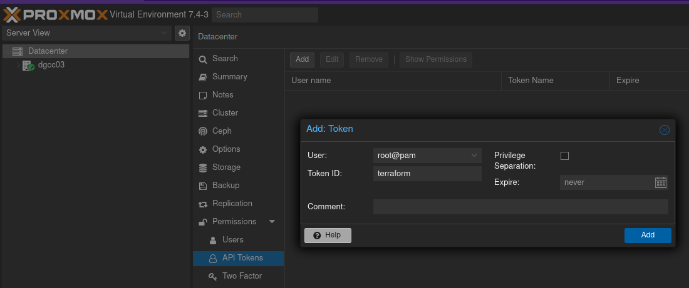

## Add an API Token
This is the way that Terrafomr will access to the Proxmox Datacenter
Go to `Datacenter->API Tokens` and hit on `Add`


## Create your credential file
Fill it with your credentials
```bash
mv sample.credentails.tfvars credentails.tfvars
```

## Provider
Create a `provider.tf` file used to create and manage resources from Proxmox.
```json

# Proxmox Provider
# ---
# Initial Provider Configuration for Proxmox

terraform {

    required_version = ">= 0.13.0"

    required_providers {
        proxmox = {
            source = "telmate/proxmox"
            version = "2.9.14"
        }
    }
}

variable "proxmox_api_url" {
    type = string
}

variable "proxmox_api_token_id" {
    type = string
}

variable "proxmox_api_token_secret" {
    type = string
}

provider "proxmox" {

    pm_api_url = var.proxmox_api_url
    pm_api_token_id = var.proxmox_api_token_id
    pm_api_token_secret = var.proxmox_api_token_secret

    # (Optional) Skip TLS Verification
    pm_tls_insecure = true

}
```
