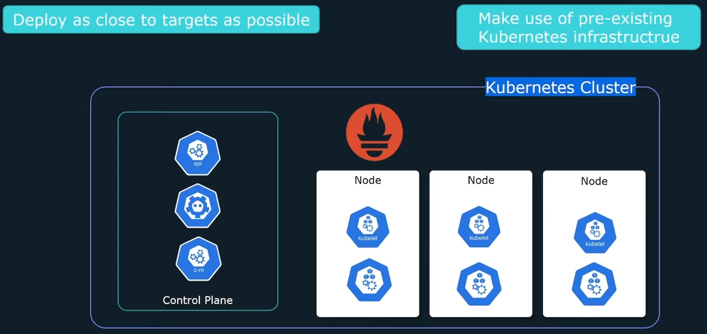
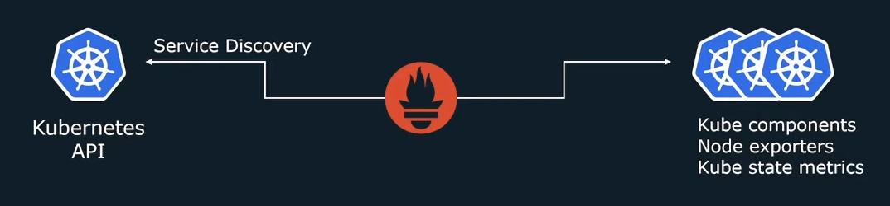
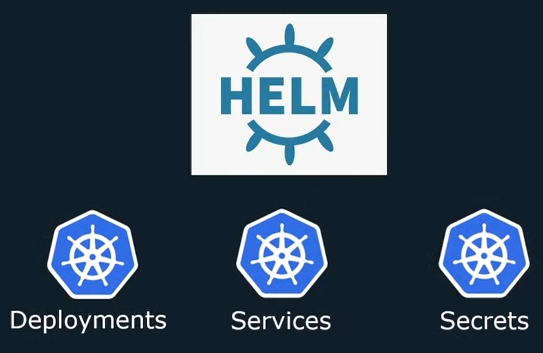
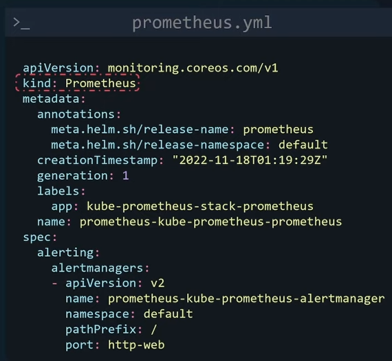

Table of Contents
- [Monitoring Kubernetes](#monitoring-kubernetes)
  - [Prometheus](#prometheus)
    - [Where to deploy](#where-to-deploy)
    - [What to monitor](#what-to-monitor)
    - [Service Discovery](#service-discovery)
    - [Deployment of Prometheus](#deployment-of-prometheus)
      - [Prometheus chart:](#prometheus-chart)

# Monitoring Kubernetes

## Prometheus

### Where to deploy

### What to monitor

- Monitor `applications` running on Kubernetes infrasteucture
- Monitor Kubernetes Cluster itself
  - Control-Plane Components (api-server, coredns, kube-scheduler)
  - Kubelet (cAdvisor) - exposing container metrics
  - Kube-state-metrics - cluster level metrics (deployments, pod)
  - Node-exporter - Run on all nodes for host related metrics (cpu, mem, network). Better option for this is to use a kubernetes daemonSet. 

### Service Discovery

Prometheus use `Service Discovery` to access to the `Kubernetes API` to discovery all the targets to monitor.

### Deployment of Prometheus

- Manually deploy: manually create all the `deployments, services, configMaps and secrets`. It is complex, requires a lot of configuration, not the easiest solution.
- Using a `Helm chart`: Helm is a package manager for Kubernetes: all applications and Kubernetes configs necessary for an application can be bundled into a package and easily deployed. 

- Helm Chart: is a collection of template & YAML files that convert into Kubernetes manifest files. 

#### Prometheus chart: 

https://github.com/prometheus-community/helm-charts/tree/main/charts/kube-prometheus-stack 

> Repository: prometheus-community  
> Chart: kube-prometheus-stack

- Prometheus Operator: The `kube-prometheus-stack` chart makes use of the `Prometheus Operator`. A Kubernetes `operator` is an application-specific controller that extends the K8s API to create/configure/manage instances of complex applications (like Prometheus).

Learn more: https://github.com/prometheus-operator/prometheus-operator

The `prometheus operator` has several custom resources extended from the Kubernetes API, such as:
- Prometheus
- Alertmanager
- ServiceMonitor
- Prometheus Rule
- Alertmanager Config
- PodMonitor
  

