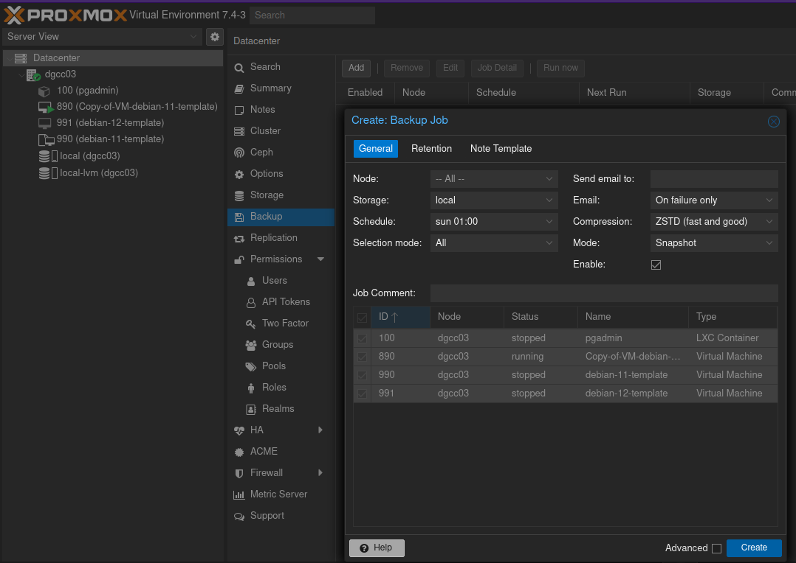
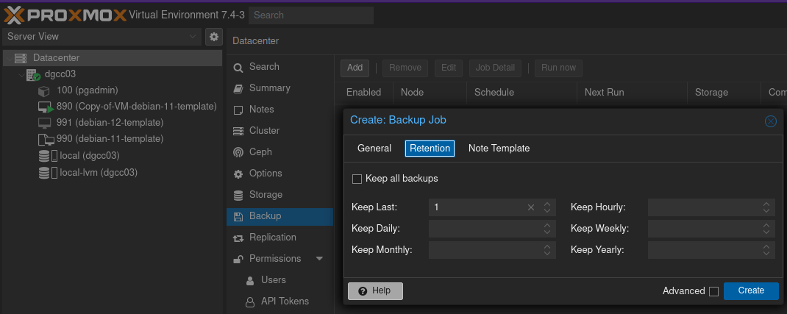
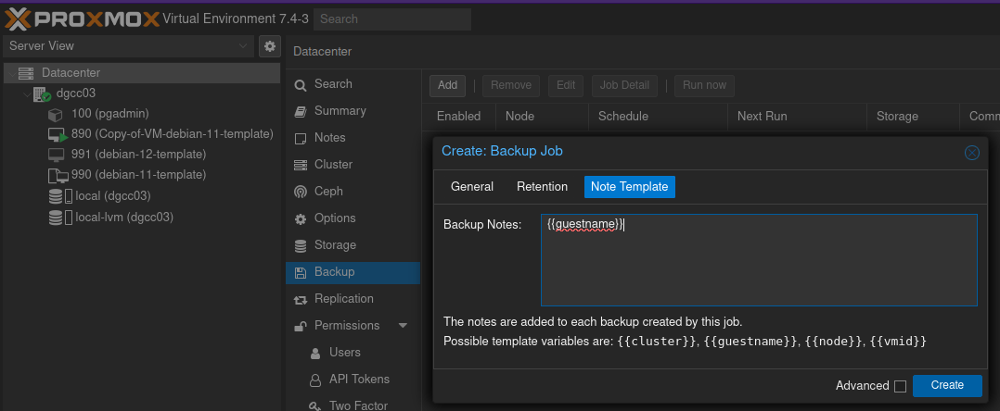
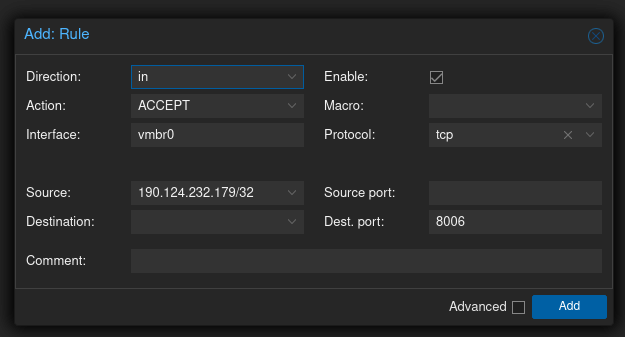
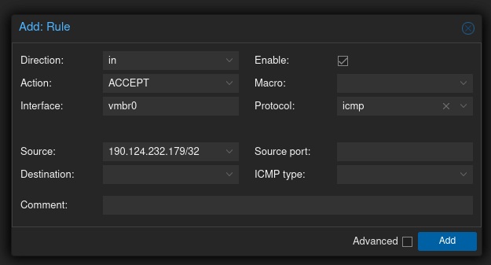
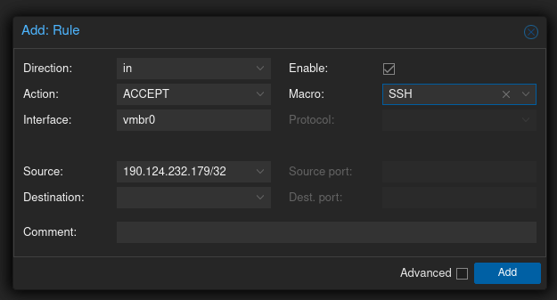
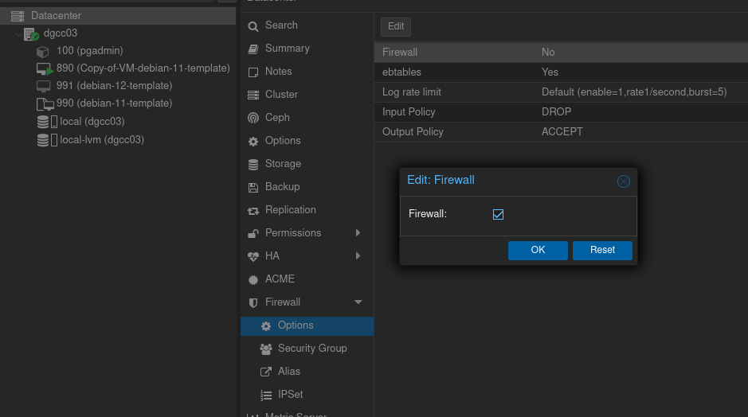
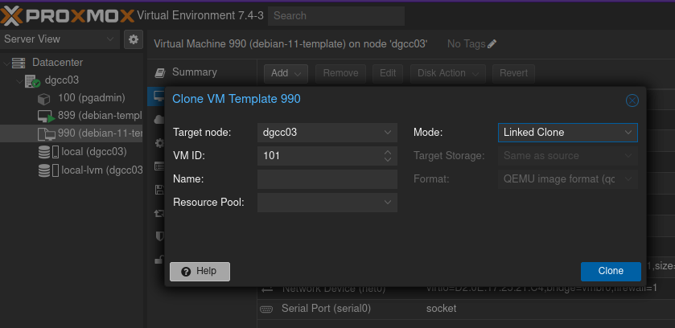

Table of Contents
- [Backup](#backup)
- [Command-Line:](#command-line)
  - [VM: `qm` command](#vm-qm-command)
    - [Basics](#basics)
    - [Configuring VM options](#configuring-vm-options)
  - [Containers: `pct` command](#containers-pct-command)
    - [Basics](#basics-1)
    - [Configuring Containtes options](#configuring-containtes-options)
- [Integrated Firewall](#integrated-firewall)
  - [Add a Firewall to allow Access to the web console at Datacenter Level](#add-a-firewall-to-allow-access-to-the-web-console-at-datacenter-level)
  - [Add a Firewall to allow Access to PING at Datacenter Level](#add-a-firewall-to-allow-access-to-ping-at-datacenter-level)
  - [Add a Firewall to allow Access to SSH at Datacenter Level](#add-a-firewall-to-allow-access-to-ssh-at-datacenter-level)
- [Resizing the VM Disk](#resizing-the-vm-disk)
- [Cloning a VM Template in Proxmox](#cloning-a-vm-template-in-proxmox)
- [Creating a VM Template in Proxmox](#creating-a-vm-template-in-proxmox)
  - [Initial Steps](#initial-steps)
    - [Create a VM](#create-a-vm)
    - [CloudInit Drive](#cloudinit-drive)
    - [Command Line Configuration](#command-line-configuration)
    - [Adding the QEMU Agent](#adding-the-qemu-agent)
    - [Converting to a Template](#converting-to-a-template)

## Backup
Go to `Datacenter->Backup`, hit on `Add` and confiugure:

`General` Tab:


`Retention` Tab


`Note` Tab


## Command-Line: 

Firts, SSH to the node.

### VM: `qm` command

#### Basics

List VMs
```bash
qm list
```

Start a VM
```bash
qm start 100
```

Shutdown a VM
```bash
qm shutdown 100
```

Stop a VM (like pressing the botton)
```bash
qm stop 100
```

Reboot a VM
```bash
qm reboot 100
```

Reset a VM (like pressing the botton)
```bash
qm reset 100
```

#### Configuring VM options

List Options that can be set
```bash
qm config 100
```

Enable `Start on boot`
```bash
qm set --onboot 1 100
```

Change RAM
```bash
qm set --memory 2048 100
```

### Containers: `pct` command

#### Basics

List Containers
```bash
pct list
```

Start a Container
```bash
pct start 100
```

Shutdown a Container
```bash
pct shutdown 100
```

Stop a Container (like pressing the botton)
```bash
pct stop 100
```

Reboot a Container
```bash
pct reboot 100
```

Reset a Container (like pressing the botton)
```bash
pct reset 100
```

#### Configuring Containtes options

List Options that can be set
```bash
pct config 100
```

Enable `Start on boot`
```bash
pct set 100 -onboot 1
```

Change RAM
```bash
pct set 100 -memory 2048
```

## Integrated Firewall

> Hint: Do not enable the Firewall before configuring it. Enabling it prematurely may block all access and restrict your ability to connect.

There are different levels of where to apply a Firewall in Proxmox:
1. Datacenter 
2. Node
3. Host 

### Add a Firewall to allow Access to the web console at Datacenter Level
Go to `Datacenter->Firewall`, hit on `Add` and confiugure:


### Add a Firewall to allow Access to PING at Datacenter Level
Go to `Datacenter->Firewall`, hit on `Add` and confiugure:


### Add a Firewall to allow Access to SSH at Datacenter Level
Go to `Datacenter->Firewall`, hit on `Add` and confiugure:


Once Configured all Firewall rules, enable it from:
Go to `Datacenter->Firewall->Options`:



## Resizing the VM Disk

1. SSH to the proxmox server

```bash
ssh root@pxm01
```

2. Resize the VM Disk (pay attention to the VM-ID an the name of its disk)
   
```bash
qm resize 899 scsi0 +20
```

3. Reboot the VM

## Cloning a VM Template in Proxmox

Just right click on the template and select `Clone`. Configure Your VM name, and change the Mode to Full Clone

> You can view the differences between a full clone and a linked clone here: https://pve.proxmox.com/wiki/VM_Templates_and_Clones



## Creating a VM Template in Proxmox

Source: https://tcude.net/creating-a-vm-template-in-proxmox/

Source: https://www.youtube.com/watch?v=MJgIm03Jxdo

### Initial Steps

#### Create a VM 

1.  General


2.  OS: select "Do not use any media". All other options can remain their default values.


3. System: enable the "Qemu Agent" checkbox.  The guest agent provides additional functionality between the VM and Proxmox, itself.


4. Disks: delete the default scsi0 disk created by Proxmox.  We will instead create our own farther along in the tutorial.

 

5. CPU

 

6. RAM

 

7. RAM

 

8. Review settings and click "Finish"

#### CloudInit Drive

1. Add a CloudInit Drive


2. Storage: Select the name of the storage pool you would like to use


3. Settings: navigate to the "Cloud-Init" tab for the template.  Here you will be able to configure some of the default settings for the template


4. Regenerate: Once settings configured, click the "Regenerate Image" button shown in the image above.


#### Command Line Configuration

1. SSH to the proxmox server

```bash
ssh root@pxm01
```

2.  Search the cloud image of Debian 11 from the following link: https://cloud.debian.org/images/cloud/ and copy the link of the image you want to use
```bash
wget https://cloud.debian.org/images/cloud/bullseye/latest/debian-11-genericcloud-amd64.qcow2
```

3. Enabling GUI Console Access: This command is necessary to be run to ensure the Proxmox GUI has console access to the VM.  If not, you will likely not be able to see anything through the console page.

```bash
qm set 990 --serial0 socket --vga serial0
```

4. Set the disk size for your VM.
   
```bash
qemu-img resize debian-11-genericcloud-amd64.qcow2 20G
```

5. Import the disk
   
```bash
qm importdisk 990 debian-11-genericcloud-amd64.qcow2 local-lvm
```

6. Check in the web UI: After running the command, you should see the change added successfully within the Hardware tab of the VM. Follow the next steps:
   - With the disk selected, you will now need to click Edit in order to add the disk
   - Before adding, I went ahead and enabled SSD emulation, as well as checking Discard to enable thin provisioning
   - Click Add. Now we can see the previously unused disk is successfully set up to be utilized by the VM/template


7. under the Options tab, you will need to modify the Boot Order. Enable `scsi0` and change its order to 2


8. Start at boot


#### Adding the QEMU Agent

1. Power up the template/VM you have created

2. SSH to the VM 

3. Install the agent
```bash
sudo apt update && sudo apt upgrade -y && sudo apt install qemu-guest-agent
```
4. Enable the agent
   
```bash
sudo systemctl enable qemu-guest-agent
```
5. Reset the machine-id
   
```bash
cat /dev/null > /etc/machine-id
```

6. Run

```bash
cloud-init clean
```

7. Shutdown

```bash
shutdown -h now
```

#### Converting to a Template

